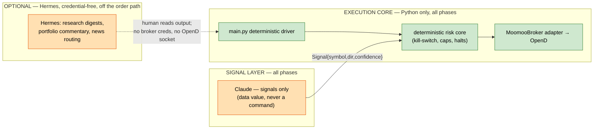
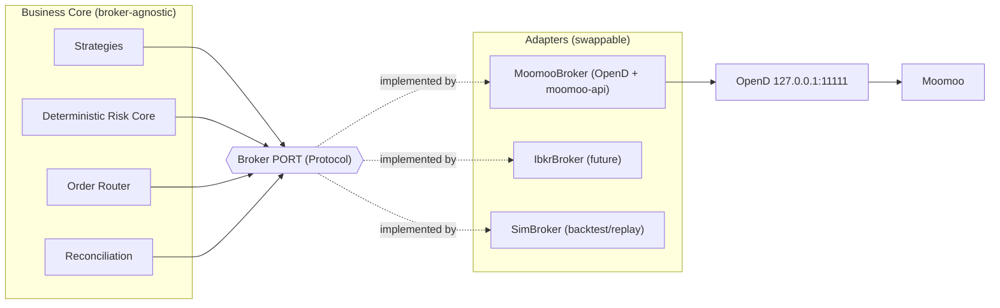
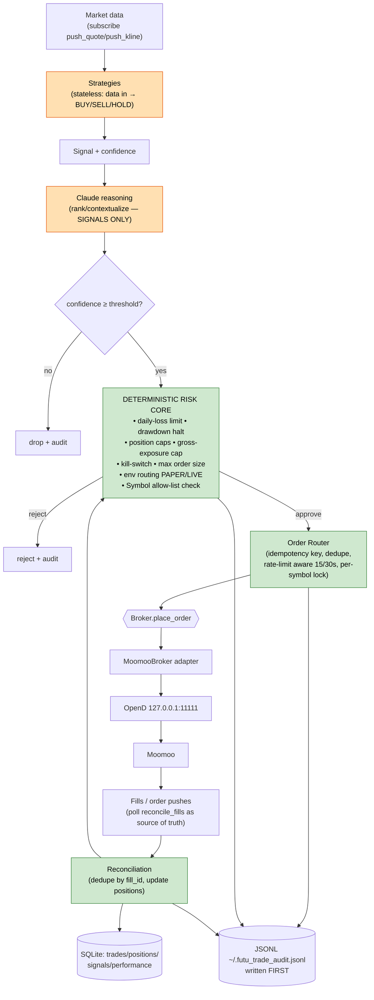
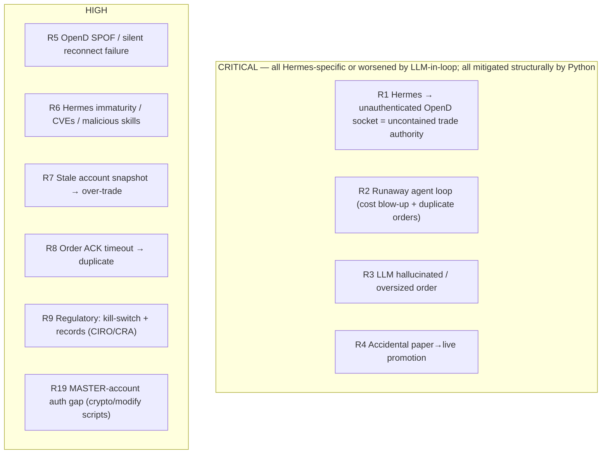
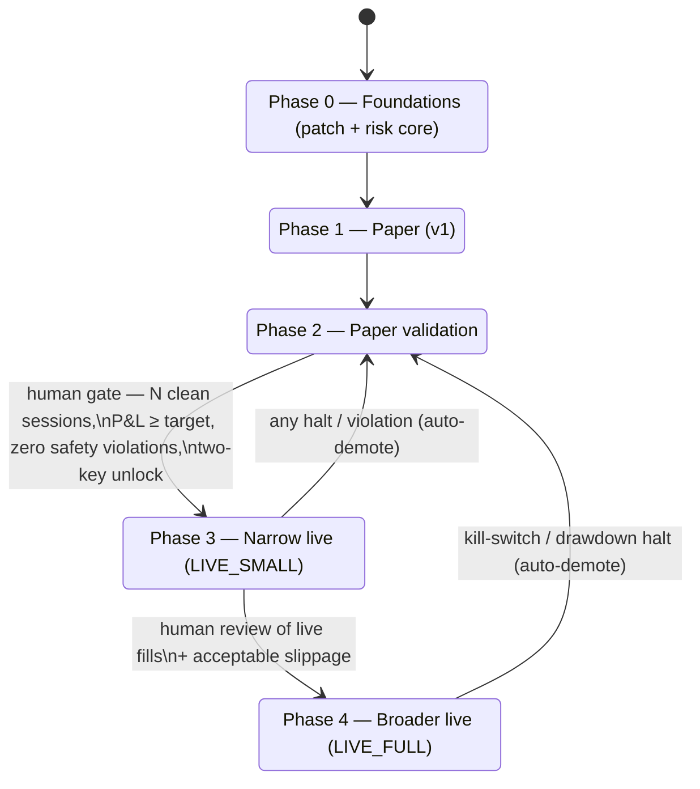

# AutoTrader Architecture Research — Hermes Runtime vs Custom Python App

**Decision:** Orchestration approach for an autonomous trading system on the Moomoo backend (Moomoo OpenAPI + local OpenD daemon at `127.0.0.1:11111`).
**Date:** 2026-06-07 · **Operator:** solo retail, British Columbia, Canada · **Branch:** develop
**Method:** 4-agent research team (business-product · financial-cost · tech-architect · devils-advocate) over 3 phases, then lead synthesis.

**Source reports (full detail, tables, and citations):**
- [`phase1-business-product.md`](./phase1-business-product.md) — approach landscape & fit
- [`phase1-financial-cost.md`](./phase1-financial-cost.md) — cost & operational economics (incl. tail-cost appendix)
- [`phase1-tech-architect.md`](./phase1-tech-architect.md) — broker-agnostic architecture & data-flow analysis
- [`phase2-devils-advocate-risk-register.md`](./phase2-devils-advocate-risk-register.md) — stress-test, independent research & risk register

> All pricing, capability, and reliability claims are cited with a 2026-06-07 retrieval date in the source reports. Tooling and prices in this space change fast; re-verify before acting.

---

## 1. Go / No-Go Recommendation

### ✅ GO — with the Python orchestration path, paper-first, and Hermes excluded from the execution loop.

| Verdict component | Decision | One-line rationale |
|---|---|---|
| **Build the system?** | **GO** | Native Moomoo tooling already exists in-repo; 1–2 weeks to first paper trade; backend cost is ~$0; safety architecture is well-understood. |
| **Which orchestrator?** | **Custom Python app** | Structurally enforces "Claude = signals only, deterministic risk in code"; neutralizes all four CRITICAL risks by construction. |
| **Hermes in the order path?** | **NO-GO** | A 4-month-old, self-modifying, shell-capable runtime holding brokerage credentials in front of an *unauthenticated* OpenD socket is an unbounded-loss failure mode. |
| **Start live or paper?** | **Paper (`TrdEnv.SIMULATE`)** | Live requires a strategy that has cleared paper validation **and** the two-key unlock; do not infer live intent. |

**Why GO is the right call.** Every structural precondition for a safe build is already favorable:

1. **The hard part is already vendored.** The repo ships 94 Moomoo scripts, `common.py` env checks, the `is_opend_ready()` exponential-backoff gate, and a read-only dashboard that is a working reference for composing on top of the skills. The remaining work is `config.py` + `broker.py` + a risk core + one strategy + `main.py`.
2. **The backend is effectively free.** Moomoo OpenD is free; US L1/L2, options, and crypto market data are currently $0 (US L2 and crypto are promotional); API trading carries no surcharge. Worst-case if all promotions end: ~$75/mo, borne equally by both paths.
3. **Regulation favors this design.** CIRO expects automated systems to carry kill-switches and price/size limits; the CRA treats frequent algo trading as business income requiring complete records. The deterministic guardrails + append-only audit trail are compliance assets, not just engineering nicety.
4. **The risks are known and structurally mitigable** — provided the LLM stays out of the execution path (see §5).

**The single most important finding gating the NO-GO on Hermes-in-the-loop:** *OpenD's local socket at `127.0.0.1:11111` is unauthenticated* — it trusts any local process that can reach the port. Any process that can open that socket **is** the trade authority. A shell-capable agent that can `pip install moomoo-api` or open a TCP socket therefore bypasses every application-level guardrail. Containment requires that the agent never has reachability to a live-capable OpenD — a fragile, all-or-nothing property a solo operator is unlikely to keep correct indefinitely.

---

## 2. Orchestration Recommendation (split by phase)

**Recommendation: a phased hybrid that is Python-only where money is at risk, and admits Hermes only as a credential-free, out-of-band research tool.**

| Phase | Orchestrator | Claude | Hermes | Rationale |
|---|---|---|---|---|
| **Paper (v1)** | Python `main.py` | Signals only | **Excluded from execution.** May be used credential-free for research/commentary if desired. | Shortest time-to-paper; containment cost ≈ 0; deterministic and auditable from day one. |
| **Narrow live (LIVE_SMALL)** | Python `main.py` | Signals only | **Excluded.** | Real money + an unauthenticated OpenD socket make any shell-capable agent in-reach indefensible. Two-key unlock + reduced caps + live-tested kill-switch. |
| **Broader live (LIVE_FULL)** | Python `main.py` | Signals only | **Excluded from order path.** Reconsider an *out-of-process, air-gapped* Hermes signal source **only** if (a) the framework matures and is independently re-audited and (b) the C1–C9 containment cage is built, tested, and audited. | The architecture (§4) keeps this door open at low cost — but it must never be a v1 dependency. |

**Why not Hermes as the runtime?** Three independent lenses converged on the same answer:

- **Product (business-product):** No native Moomoo integration; non-deterministic execution path; no financial authorization layer; self-modifying skills; context compression silently drops constraints. The fair reframe — "a trading app built *on* the Hermes runtime" — *strengthens* the case against it, because the execution path then runs *inside* the LLM inference loop and you cannot carve a deterministic sublayer inside a non-deterministic runtime without rebuilding the Python path from scratch. Verdict: **disqualified from the execution path on structural grounds; permissible only for credential-free, read-only commentary/research.**
- **Cost (financial-cost):** Hermes adds a second model layer and a runaway-loop tail; once non-reproducible-incident labor is counted, Hermes Year-2 all-in is ~3.5× the Python path. Hermes's only win is Year-1 dev hours (~25 vs ~98) — paid back by higher ongoing risk and maintenance.
- **Risk (devils-advocate):** All four CRITICAL risks are Hermes-specific or made far worse by an LLM in the execution path; the Python path neutralizes them by construction. A solo operator keeping all nine containment controls correct over time is ~15–25% and degrading.

**Why Python preserves the core principle.** Claude's output is a *data value* (`Signal{symbol, direction, confidence, rationale}`), not a command. It is passed to a deterministic validation layer; risk limits are frozen dataclasses, immutable at runtime; Claude cannot call `place_order` — only the risk core can, and only after every check passes. The separation is enforced by architecture, not convention.

---

## 3. Cost Summary — Hermes vs Python, per decision-cadence tier

**Shared assumptions:** Claude **Sonnet 4.6** for signals (`$3/$15` per MTok in/out) with 5-minute prompt caching; VPS = Hetzner CPX31 US-Ashburn ($25.59/mo); Moomoo market data $0 (promotions holding); developer opportunity cost $150/hr. Hermes adds a Haiku-4.5 orchestration layer. *(Source: `phase1-financial-cost.md`, retrieved 2026-06-07.)*

### 3.1 Claude signal-layer cost by cadence (with cache) — identical for both paths

| Model | 1/day | 4/day | **24/day** | 96/day |
|---|---|---|---|---|
| Haiku 4.5 | $2.08/yr | $8.32/yr | **$49.93/yr** | $199.73/yr |
| **Sonnet 4.6** ✅ | $6.24/yr | $24.98/yr | **$149.80/yr** | $599.19/yr |
| Opus 4.6 | $10.40/yr | $41.61/yr | **$249.66/yr** | $998.64/yr |

### 3.2 12-month TCO by cadence (Sonnet 4.6, cached, all-in incl. dev + maintenance)

| Cadence | Hermes Year 1 | Python Year 1 | Hermes Year 2+ | Python Year 2+ |
|---|---|---|---|---|
| 1 decision/day | $5,879 | $15,253 | $2,127 | $760 |
| 4 decisions/day | $5,933 | $15,282 | $2,160 | $760 |
| **24 decisions/day** | **$6,034** | **$15,607** | **$2,284** | **$907** |
| 96 decisions/day | $6,399 | $16,256 | $2,649 | $1,256 |

> **Post-stress-test correction.** When non-reproducible-incident labor is properly costed (10–28 hrs / $750–$2,100 per Hermes incident, 2–3/yr), Year-2+ all-in widens to **Hermes ~$4,430 vs Python ~$1,282 (≈3.5×)**. Cash-only (no labor) the paths are ~tied: **Hermes ~$484 vs Python ~$457/yr.**

### 3.3 Where the dominant cost sits

| Horizon | Dominant line | Notes |
|---|---|---|
| **Year 1** | Developer time (89–97% of total) | Hermes ~25 hrs ($3,750) vs Python ~98 hrs ($14,700). Everything else is rounding error. |
| **Year 2+ (cash)** | VPS (~67%) > Claude inference (~33%) | Market data $0. Inflection at ~40–50 decisions/day where Claude spend overtakes VPS. |
| **Year 2+ (all-in)** | Maintenance labor | Hermes carries 4–5× Python's, driven by non-determinism incident response. |

### 3.4 Tail / worst-case (the real reason cost favors Python)

| Risk line | Python | Hermes |
|---|---|---|
| Worst-case inference (96/day, 5× price) | ~$2,996/yr | ~$3,726/yr (+orchestration layer) |
| Overnight uncapped API loop (Tier 2, 8 hr) | N/A (no agent loop) | **$334–$1,300 / incident** |
| Non-determinism incidents (2–3/yr) | N/A (deterministic) | **$1,500–$5,400/yr** |
| First live incident (expected, both paths) | ~$1,257 | ~$1,257 + autonomous-skill bypass vector |

> **Critical operational fact:** the Anthropic console offers only a **monthly** spend cap — there is **no daily cap**, and rate limits throttle throughput but do not stop spend. An overnight runaway loop can burn the whole month's budget and halt legitimate trading. Bound it with a dedicated non-default workspace + workspace ITPM sub-limit (~$50/day throttle) + a client-side circuit breaker on `anthropic-ratelimit-remaining-tokens`. This control is mandatory for Hermes and good hygiene for Python.

---

## 4. Architecture Recommendation

### 4.1 Core principle — three rings; the split that matters is *orchestrator vs deterministic risk core*

Cut the system into three rings. The risk core sits **between** the reasoning ring and the broker ring as a gate the orchestrator cannot edit at runtime.

- **Ring 1 — Reasoning / orchestration (non-deterministic):** Claude signals; in v1 driven by a deterministic Python loop. (A future Hermes runtime would be a Ring-1 driver only.)
- **Ring 2 — Deterministic risk core + order router:** the safety spine. Signal in → validated order out. Holds the *only* trade-capable broker handle.
- **Ring 3 — Broker port + adapter:** a stable `Broker` interface with a `MoomooBroker` adapter confining all Moomoo-isms.

This is what makes the orchestration choice **reversible and low-stakes**: swap the Ring-1 driver and Rings 2–3 are byte-identical.

### 4.2 Broker-agnostic abstraction (so Moomoo can be swapped without rewriting business logic)

A single `Broker` Protocol — `connect`/`is_ready`/`close`, `get_quote`/`subscribe`, `place_order`/`cancel_order`/`cancel_all`, `get_positions`/`get_account`/`get_open_orders`/`reconcile_fills` — over neutral domain dataclasses (`Symbol`, `Quote`, `OrderRequest`, `OrderAck`, `Fill`, `Position`, `AccountSnapshot`), a normalized `BrokerError` taxonomy, and a canonical `OrderState` enum. **All** Moomoo dialect (`US.AAPL` codes, `TrdEnv.SIMULATE`, `(ret_code, data)`, `OrderStatus` mapping, `refresh_cache=True` for US paper `STOCK_AND_OPTION`, never calling `unlock_trade`) is confined to the `MoomooBroker` adapter. `is_ready()` reuses the existing `is_opend_ready()` gate verbatim. *(Full interface pseudocode, adapter, and invariant table in `phase1-tech-architect.md` §1.)*

> **v1 cut-line (tech-architect):** *Safety lives in the risk core, not the abstraction.* Ship `MoomooBroker` as a plain concrete class with these method names (promoting to a formal Protocol later is a ~30-min mechanical refactor). Build the *port* now (it confines Moomoo-isms and enables `SimBroker` unit tests with no live OpenD); defer extra adapters, the IPC gate, and Hermes until a strategy clears paper validation.

### 4.3 Trade-loop architecture (both paths share everything below the risk core)

The deterministic risk gate (the safety spine) refuses on a stale account snapshot, engages the kill-switch + `cancel_all` on a daily-loss or drawdown halt, clamps order size, enforces position/exposure caps, validates the symbol against a tradable allow-list, and routes PAPER/LIVE by the two-key rule. *(Pseudocode in `phase1-tech-architect.md` §3.2.)*

### 4.4 Data-flow analysis highlights (full 9-stage lineage + 18 edge cases in source)

Key edge cases that the risk core / router / reconciliation must handle:

| # | Edge case | Required handling |
|---|---|---|
| E1 | Stale account snapshot (US paper `STOCK_AND_OPTION`) | Adapter forces `refresh_cache=True`; risk core rejects on `snapshot.stale`. |
| E2 | Order ACK timeout / socket drop mid-call | Map to `OrderState.UNKNOWN` — **never** a success; reconcile by `client_order_id` before any retry. |
| E4 | Missing fill push (US paper) | Poll `reconcile_fills(since)` as source of truth, not pushes. |
| E8 | OpenD disconnect mid-session | Watchdog → `is_ready()` backoff reconnect; **full reconcile before resuming**. |
| E9 | Concurrent orders, same symbol | Per-symbol serialization lock + idempotency key; re-read positions under lock. |
| E11/E13 | Crypto is REAL-only (no SIMULATE) | Adapter rejects crypto+PAPER as `UNSUPPORTED`; never auto-promote to LIVE. |
| E17 | Accidental paper→live promotion | Two-key rule: `TRADING_ENV=LIVE` **and** manual GUI unlock, both checked. |
| E18 | Audit write failure (disk full) | Hard error → halt new orders (no order without its audit line written first). |

### 4.5 OpenD operational design (the irreducible SPOF)

OpenD is a local GUI daemon with no cloud fallback and a manual login/2FA that cannot be fully automated; its token-expiry reconnect can **silently fail**. Mitigation is operational, not a software trick:

- Reuse `is_opend_ready()` (exponential backoff; raise + halt on timeout — never trade blind).
- Watchdog heartbeat (lightweight `get_global_state`) → **soft-halt first** (stop new orders) → backoff reconnect → **full reconcile** before resuming → kill-switch + `cancel_all` if not recovered within a grace window.
- **For live:** fail-to-flat / reduce-only default on OpenD loss beyond grace; **hard stops resting at the broker** so an outage can't run a position unbounded; an out-of-band manual kill via the Moomoo app/GUI (not the OpenD socket); dedicated always-on host + supervisor.
- A **second broker adapter is a resilience enhancement, not the fix** — it can place new orders elsewhere but cannot flatten a position already held at Moomoo during an outage.

### 4.6 Persistence + audit schema

SQLite tables — `signals`, `trades` (one row per order intent, `client_order_id UNIQUE`), `fills` (`fill_id PRIMARY KEY` for dedupe), `positions`, `performance` (daily roll-up the risk core reads for halts), `halts` — in WAL mode (concurrent dashboard reader + trade-loop writer). Append-only JSONL audit at `~/.futu_trade_audit.jsonl`, one object per decision/broker interaction, **written before any order is placed**. JSONL is the immutable journal; SQLite is the queryable projection. *(Full DDL in `phase1-tech-architect.md` §5.)*

### 4.7 Safety containment — why Hermes can't be cheaply contained

A self-modifying, shell-capable agent **cannot be contained by guardrails it can read, rewrite, or reach around.** Because OpenD's socket is unauthenticated, an agent that can `pip install moomoo-api` or open `127.0.0.1:11111` simply opens its own trade context and bypasses the entire risk core (paper *and* live). Making Hermes's guarantees equal to Python's requires a 9-control out-of-process cage (separate uid, read-only core mount, **no OpenD route in the sandbox network namespace**, single `submit_signal` IPC egress, LIVE key held only by the core, core-owned audit, core-domain watchdog, operator-owned cron, gate-side rate-limit/schema-validation). **C3 (no OpenD route in the sandbox) is single-point and load-bearing** — if it silently regresses there is no defense-in-depth behind it. For a solo operator this is ~15–25% likely to be built and *kept* correct. Hence: keep Hermes paper-only or air-gap OpenD onto a separate host; exclude it from v1 execution entirely.

---

## 5. Risk Register

Severity adjusted for a **solo retail operator, real money**. Path: **H** = Hermes-specific, **P** = Python-specific, **B** = both. *(Full register with likelihood/impact/residual columns and citations in `phase2-devils-advocate-risk-register.md` §4.)*

| ID | Risk | Path | Severity | Specific mitigation |
|----|------|------|----------|---------------------|
| **R1** | Shell-capable Hermes opens the **unauthenticated** `127.0.0.1:11111` socket itself, bypassing the risk core (paper *and* live). C3 is the single load-bearing control with no defense-in-depth behind it. | H | **CRITICAL** | **Exclude Hermes from execution in v1.** Never give a shell-capable agent reachability to a live-capable OpenD — keep it paper-only or air-gap OpenD on a separate host. Two-key GUI unlock (R4) is the only blast-radius cap when containment is weak. |
| **R2** | Overnight retry/reasoning loop → token blow-up ($100–$1,300/incident) and duplicate live orders. | H | **CRITICAL** | Anthropic has **no daily cap** (monthly only). Dedicated non-default workspace + workspace ITPM sub-limit (~$50/day) + monthly cap at 3–5× expected + client-side circuit breaker; idempotent `client_order_id`; per-symbol serialization. (Python path has no autonomous loop.) |
| **R3** | LLM hallucinates symbol/size or is over-confident → oversized/wrong order. | B (worse H) | **CRITICAL** | Claude = signals only (data value); deterministic confidence threshold + `max_order_notional` clamp + position/exposure caps in code; `Symbol` allow-list; read-only state store. Clamp is always in-path in Python; bypassable in Hermes. |
| **R4** | Accidental paper→live promotion (env flag flipped or self-promotion) → real-money orders during validation. | B | **CRITICAL** | **Two-key rule:** `TRADING_ENV=LIVE` **and** manual OpenD GUI unlock; never call `unlock_trade` via SDK; LIVE key held only by the core; **auto-demotion to paper on any halt**; promotion is human-only. |
| **R5** | OpenD SPOF: crash / sleep / silent token-expiry reconnect failure → loop blind, orphan orders, missed exits. | B | **HIGH** | Fail-to-flat / reduce-only default beyond grace; resting hard stops at the broker; out-of-band manual kill; dedicated host + supervisor; `is_ready()` gate + watchdog + full reconcile before resuming. A 2nd adapter is an enhancement, not the fix. |
| **R6** | Hermes immaturity: 4 Critical + 9 High audit findings, 3 CVEs, plaintext creds, ~36% of marketplace skills injectable, container approval-bypass. | H | **HIGH** | Exclude from any credentialed/execution role in v1. If used for research: credential-free, VM-isolated, deny-by-default skills, memory encrypted, all tool calls logged; pin versions; re-audit each upgrade. |
| **R7** | Stale account snapshot (US paper `STOCK_AND_OPTION` w/o `refresh_cache=True`) → risk checks on wrong P&L → over-trade past loss limit. | B | **HIGH** | Adapter forces `refresh_cache=True`; risk core rejects on `snapshot.stale`; never compute halts on a stale basis. |
| **R8** | Order ACK timeout / socket drop mapped as success → duplicate on retry. | B | **HIGH** | Map TIMEOUT → `OrderState.UNKNOWN` (never success); query open orders by `client_order_id` before any retry; idempotency key in remark. |
| **R9** | Regulatory/compliance: missing kill-switch or trade records (CIRO expects safeguards; CRA treats algo trading as business income). | B | **HIGH** | Deterministic kill-switch + price/size limits (CIRO-aligned); append-only JSONL + SQLite = tax record; confirm Moomoo crypto availability to a BC resident before live crypto. |
| **R19** | Known **MASTER-account authorization gap** in `place_crypto_order.py` & `modify_order.py` (missing the role check `place_order.py` has) → trades hit a master account affecting the whole group. | B (H adds bypass) | **HIGH** | **Patch before any live deploy:** add `place_order.py`'s MASTER role-rejection check to both scripts. Raises first-live-incident EV to $2.5–4.2k if unpatched. |
| R10 | Rate-limit breach (`place_order` 15/30s, snapshot 60/30s, refresh 10/30s) → silent rejects / starved reconciliation. | B | MEDIUM | Router token-bucket; cap reconcile cadence; `refresh_seconds ≥ 20`; surface `RATE_LIMIT` as retryable. |
| R11 | Model price shock (2–5×) and/or cadence creep to 96/day → inference up to ~$4.7k (Py) / ~$6–8k (Hermes). | B (worse H) | MEDIUM | Provider spend caps; cadence ceiling in config; prompt caching; model-substitution plan (Haiku/cheaper orchestration). |
| R12 | Hermes context compression silently drops a risk constraint set early in a session. | H | MEDIUM (→HIGH if Hermes holds any limit) | Never store risk limits in LLM context — frozen-dataclass config read by the deterministic core only. |
| R13 | Crypto REAL-only on Moomoo → "paper" crypto silently routed live. | B | MEDIUM | Adapter rejects crypto+PAPER as `UNSUPPORTED`; defer crypto to a post-paper phase. |
| R14 | US paper accounts may not receive fill push → position/P&L drift. | B | MEDIUM | Poll `reconcile_fills(since)` as source of truth; dedupe by `fill_id`. |
| R15 | Over-engineering (full abstraction/IPC/2nd adapter) before a profitable strategy → delayed paper ship. | P | MEDIUM | v1 cut-line (§4.2); build the port, defer the rest. |
| R16 | Audit write failure (disk full) → silent loss of forensic/tax trail. | B | LOW | Audit-write failure = hard error → halt new orders. |
| R17 | HK Level-2 data cost / HK calendar complexity. | B | LOW | Defer HK to phase 2; HK L1 free; model L2 cost before enabling. |
| R18 | Clock/ts skew → wrong "today" P&L window → daily-loss halt mis-times. | B | LOW | Use broker-provided fill timestamps; derive day boundary from market calendar. |

**Severity tally:** CRITICAL ×4 (R1–R4) · HIGH ×6 (R5–R9, R19) · MEDIUM ×6 (R10–R15) · LOW ×3 (R16–R18).
**Decisive observation:** every CRITICAL risk is Hermes-specific or worsened by an LLM in the execution path, and the Python path neutralizes all four *structurally*.

---

## 6. Implementation Phases (staged rollout, safety-first)

| Phase | Scope | Key deliverables | Effort | Exit gate |
|---|---|---|---|---|
| **0 — Foundations** | De-risk before any execution code | Patch **R19** MASTER-account gap in `place_crypto_order.py` & `modify_order.py`; `config.py` frozen-dataclass `RiskConfig` (daily-loss, drawdown, position caps, gross-exposure, max order size, confidence threshold) — risk limits require explicit human review to change. | ~1–2 days | Gap patched & tested; risk config reviewed. |
| **1 — Paper (v1)** | Shortest safe path to first paper trade | `risk_core.evaluate()` (pure, deterministic, unit-tested with fixtures); concrete `MoomooBroker` (method names matching the future port); `broker.py`; one stateless strategy with an explicit stop-loss/take-profit; `main.py` (reuse `is_opend_ready()` → subscribe → strategy → Claude signal → confidence filter → risk core → order); JSONL audit written-first; idempotency + "UNKNOWN is never success". **No Hermes, no IPC gate, no 2nd adapter, no SQLite-as-source, no crypto, no HK L2.** | ~1–2 weeks (~80–116 hrs) | One order placed & cancelled in `TrdEnv.SIMULATE`; fill handling verified; all risk-core unit tests green. |
| **2 — Paper validation** | Prove safety + signal quality before any real money | Run weeks of clean sessions; add SQLite projection + dashboard wiring; watchdog heartbeat + soft-halt + full-reconcile-on-reconnect; per-symbol concurrency lock; rate-limit token-bucket. Track P&L, max drawdown, and **zero** safety violations. | ~1–2 weeks + multi-week soak | N clean sessions, P&L ≥ target, max-dd within limit, zero safety violations. **Human promotion gate.** |
| **3 — Narrow live (LIVE_SMALL)** | First real money, tightly bounded | Two-key unlock (`TRADING_ENV=LIVE` + manual GUI unlock); **reduced size caps (e.g. 10%)**; kill-switch tested *live*; fail-to-flat / reduce-only on OpenD loss; resting hard stops at the broker; out-of-band manual kill; dedicated always-on host + supervisor. Auto-demote to paper on any halt. | ~1 week setup + live soak | Human review of live fills; acceptable slippage; kill-switch verified live. |
| **4 — Broader live (LIVE_FULL)** | Scale caps, add asset classes deliberately | Raise caps gradually; add crypto (REAL-only — handle with care) and HK (L1 first) as separate, individually-validated phases. **Optional, gated:** consider building the formal `Broker` Protocol + a 2nd broker adapter for redundancy, and — only if Hermes matures and is re-audited — an air-gapped, credential-free Hermes signal source behind the out-of-process gate (C1–C9). | Per asset class / feature | Each new asset class clears its own paper→live validation. |

**Guiding rules across all phases:** promotion is a human gate; demotion is automatic on any halt; the agent never holds the LIVE key; no trading on a stale snapshot or a failed health check; no order without its audit line written first; risk-limit changes require explicit human review.

---

## Appendix — Method & provenance

- **Phase 1 (parallel):** business-product (Sonnet), financial-cost (Sonnet), tech-architect (Opus) researched independently and reported to the lead.
- **Phase 2 (sequential):** devils-advocate (Opus) stress-tested all three authors via direct messaging — business-product walked back Hermes maturity claims and made the out-of-execution position unconditional; financial-cost re-quantified tail costs upward; tech-architect surfaced the **unauthenticated-OpenD-socket** finding that collapses Hermes containment to one load-bearing control — then ran independent regulatory/LLM-risk/Hermes-maturity/OpenD research and compiled the 19-row risk register.
- **Phase 3 (lead):** this synthesis.
- **Convergence:** all four agents independently reached the same conclusion — **build it, Python path, paper-first, Hermes out of the order path.** The stress-test strengthened rather than overturned the Phase 1 conclusions.
- Full citations (with 2026-06-07 retrieval dates) live in the four linked source reports.
