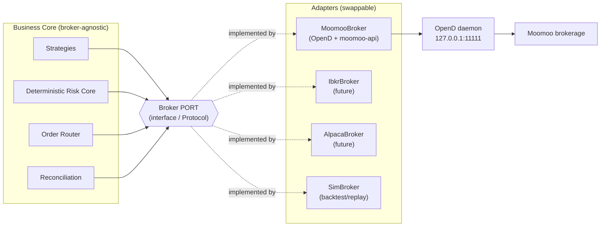
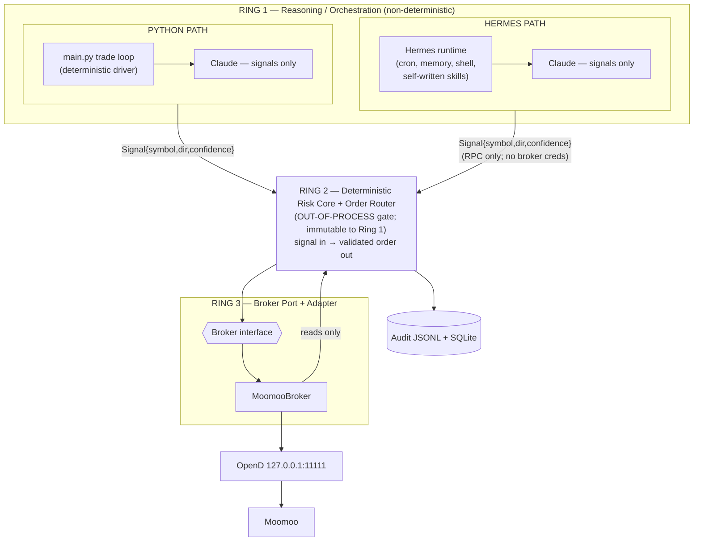
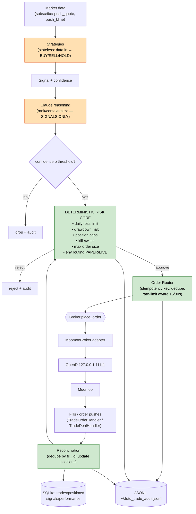
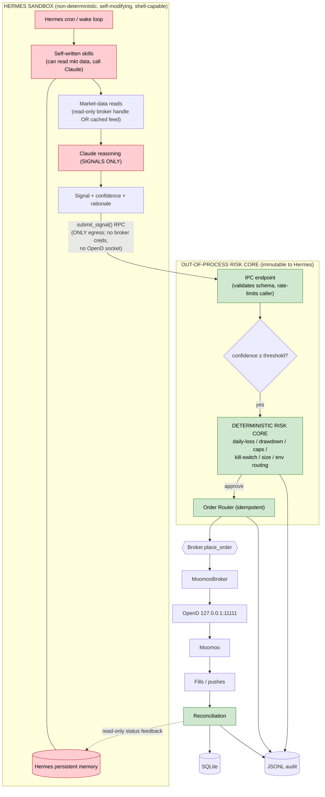
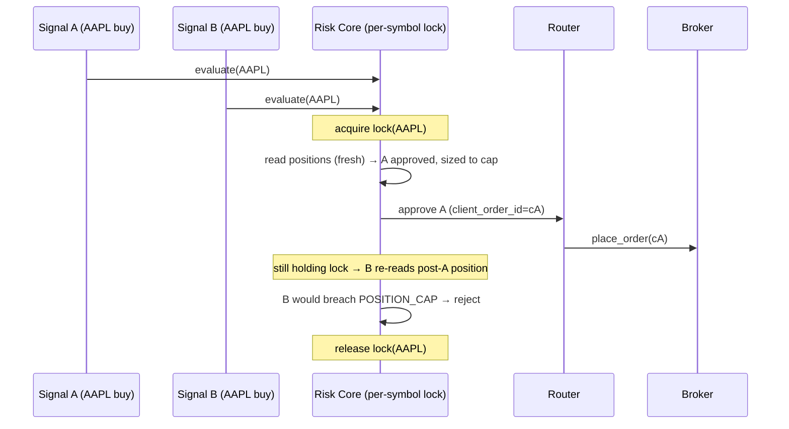
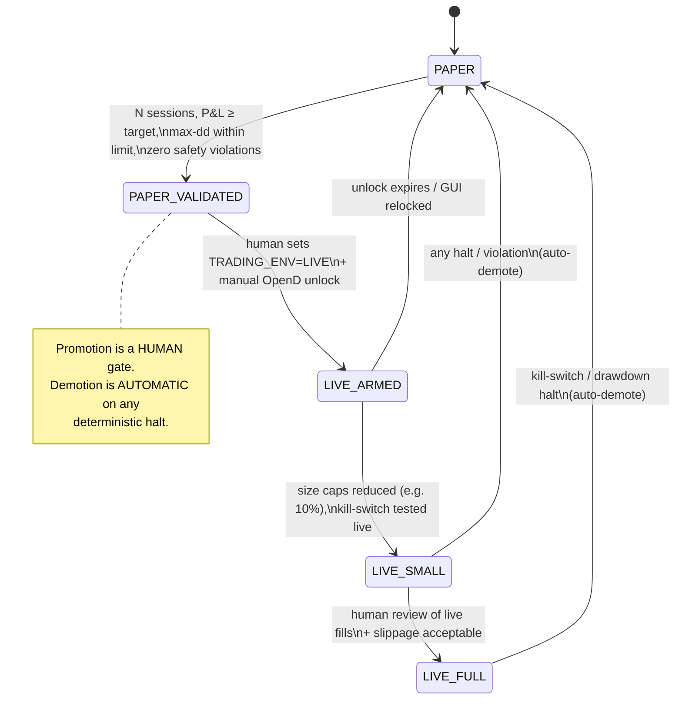
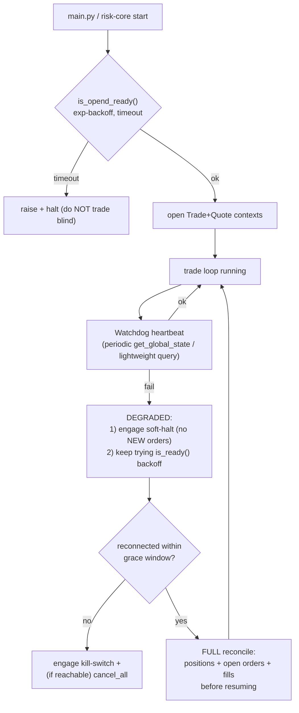
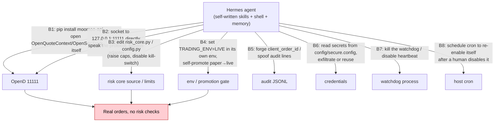
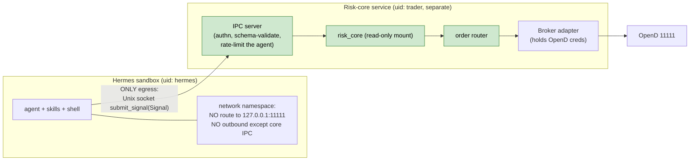

# Phase 1 — Tech Architect Findings: Broker-Agnostic Architecture

**Agent:** AGENT 3 (tech-architect)
**Date:** 2026-06-07
**Scope:** Broker-agnostic architecture for an autonomous trading system on Moomoo, designed so the broker can be swapped without rewriting business logic, and showing how each candidate orchestration (HERMES vs PYTHON) plugs into the *same* layer.

---

## 0. Executive Summary

- **The split that matters is not Hermes-vs-Python — it is _orchestrator_ vs _deterministic risk core_.** Whichever orchestration we pick, the system must be cut into three rings: (1) a non-deterministic **reasoning/orchestration ring** (Claude signals, optionally a Hermes runtime), (2) a deterministic **risk-core + order-router ring** that the orchestrator *cannot edit at runtime*, and (3) a **broker-adapter ring** behind a stable `Broker` interface. The risk core sits *between* rings 1 and 3 as an out-of-process gate.
- **Broker abstraction shape:** a single `Broker` Protocol (`get_quote`, `subscribe`, `place_order`, `cancel_order`, `get_positions`, `get_account`, `reconcile_fills`, plus lifecycle `connect`/`is_ready`/`close`) with normalized domain dataclasses (`Quote`, `OrderRequest`, `OrderAck`, `Fill`, `Position`, `AccountSnapshot`) and a normalized `BrokerError` taxonomy. A `MoomooBroker` adapter wraps OpenD/`moomoo-api`, preserving every existing invariant (`(ret_code, data)` checks, `TrdEnv.SIMULATE` default, `refresh_cache=True` for US paper `STOCK_AND_OPTION`, never calling `unlock_trade`).
- **Key containment finding:** A self-modifying, shell-capable Hermes agent **cannot be contained by guardrails it can read or rewrite.** Containment requires that the risk core (a) run **out-of-process** from the agent, (b) own the **only** path to a broker that can place orders (the agent gets *no* broker credentials and *no* OpenD socket — only an RPC to the risk core), (c) be **immutable to the agent** (separate uid / read-only mount / no write or exec rights to the core's code), and (d) be the **sole holder of the live-trading switch**. If the agent can `pip install moomoo-api`, open `127.0.0.1:11111` itself, or edit the risk-core source, every guardrail is theater. With that out-of-process gate in place, Hermes becomes "just another signal source" and the deterministic guarantees are identical to the Python path. **Given that the Python path gets the same guarantees with far less containment engineering, the Python path is the recommended route to first paper-profitability; Hermes is a post-validation enhancement, not a v1 dependency.**

---

## 1. Broker Abstraction (Deliverable 1)

### 1.1 Design principle: hexagonal / ports-and-adapters

Business logic (strategies, risk core, order router, reconciliation) depends **only** on the `Broker` *port* — an abstract interface expressed in our own domain vocabulary. Moomoo/OpenD is one *adapter* implementing that port. Swapping brokers = writing a new adapter + a new code-normalization map; **zero** changes to strategies, risk core, router, audit, or persistence.



### 1.2 Normalized domain types (the contract surface)

The whole point of broker-agnosticism is that **nothing above the port speaks Moomoo dialect.** Moomoo-isms — `US.AAPL` code format, `TrdEnv.SIMULATE`, `RET_OK`, `OrderStatus.FILLED_PART`, `refresh_cache` — are confined to the adapter. Above the port we use neutral types:

```python
# domain.py  — broker-agnostic vocabulary. No moomoo import anywhere in this file.
from dataclasses import dataclass
from enum import Enum
from decimal import Decimal
from typing import Optional, Sequence

class AssetClass(Enum):
    EQUITY = "EQUITY"; ETF = "ETF"; OPTION = "OPTION"; CRYPTO = "CRYPTO"; FUTURE = "FUTURE"

class Side(Enum):
    BUY = "BUY"; SELL = "SELL"

class TimeInForce(Enum):
    DAY = "DAY"; GTC = "GTC"; IOC = "IOC"; FOK = "FOK"

class OrderKind(Enum):
    MARKET = "MARKET"; LIMIT = "LIMIT"

class TradeEnv(Enum):              # neutral name; adapter maps to TrdEnv.SIMULATE/REAL
    PAPER = "PAPER"; LIVE = "LIVE"

class OrderState(Enum):            # canonical lifecycle — adapter maps broker codes onto this
    PENDING_NEW = "PENDING_NEW"    # we sent it, no ack yet
    NEW = "NEW"                    # broker acked, working
    PARTIALLY_FILLED = "PARTIALLY_FILLED"
    FILLED = "FILLED"
    CANCELLED = "CANCELLED"
    REJECTED = "REJECTED"
    EXPIRED = "EXPIRED"
    UNKNOWN = "UNKNOWN"            # never treated as success (see edge cases)

@dataclass(frozen=True)
class Symbol:
    """Broker-neutral instrument id. The adapter maps to/from 'US.AAPL', 'CC.BTCUSD', etc."""
    ticker: str                   # "AAPL", "00700", "BTCUSD"
    market: str                   # "US", "HK", "CN", "CC", "SG"
    asset_class: AssetClass

@dataclass(frozen=True)
class Quote:
    symbol: Symbol; last: Decimal; bid: Decimal; ask: Decimal
    bid_size: Decimal; ask_size: Decimal; ts_epoch: float; stale: bool

@dataclass(frozen=True)
class OrderRequest:
    symbol: Symbol; side: Side; qty: Decimal
    kind: OrderKind = OrderKind.LIMIT
    limit_price: Optional[Decimal] = None
    tif: TimeInForce = TimeInForce.DAY
    env: TradeEnv = TradeEnv.PAPER            # paper by default, always
    client_order_id: str = ""                 # idempotency key WE generate (see races)

@dataclass(frozen=True)
class OrderAck:
    client_order_id: str; broker_order_id: Optional[str]
    state: OrderState; reason: str = ""; ts_epoch: float = 0.0

@dataclass(frozen=True)
class Fill:
    broker_order_id: str; client_order_id: Optional[str]
    symbol: Symbol; side: Side; qty: Decimal; price: Decimal
    fee: Decimal; ts_epoch: float; fill_id: str          # dedupe key for reconciliation

@dataclass(frozen=True)
class Position:
    symbol: Symbol; qty: Decimal; avg_cost: Decimal
    market_value: Decimal; unrealized_pnl: Decimal

@dataclass(frozen=True)
class AccountSnapshot:
    account_id: str; env: TradeEnv; cash: Decimal; total_equity: Decimal
    buying_power: Decimal; positions: Sequence[Position]; ts_epoch: float; stale: bool
```

### 1.3 The `Broker` port (interface pseudocode)

```python
# broker.py — the PORT. Pure abstraction; imports only domain.py.
from typing import Protocol, Sequence, Callable, Optional
from domain import (Symbol, Quote, OrderRequest, OrderAck, Fill,
                    Position, AccountSnapshot, TradeEnv)

class BrokerError(Exception):
    """Normalized failure. Adapters translate native errors into these codes so the
    core never branches on broker-specific strings."""
    class Code(Enum):
        NOT_READY      = "NOT_READY"        # daemon/socket down  (maps OpenD unreachable)
        AUTH           = "AUTH"             # not logged in / unlock needed
        RATE_LIMIT     = "RATE_LIMIT"       # maps 15/30s place_order etc.
        REJECTED       = "REJECTED"         # broker refused the order
        BAD_REQUEST    = "BAD_REQUEST"      # malformed code/qty/price
        TRANSIENT      = "TRANSIENT"        # timeout / disconnect mid-call -> UNKNOWN order
        UNSUPPORTED    = "UNSUPPORTED"      # e.g. crypto market order on FUTUSG
    code: "BrokerError.Code"; retryable: bool; detail: str

class Broker(Protocol):
    # ---- lifecycle ----
    def connect(self) -> None: ...
    def is_ready(self, timeout: float = 30.0) -> bool: ...   # exponential-backoff gate
    def close(self) -> None: ...

    # ---- market data ----
    def get_quote(self, symbols: Sequence[Symbol]) -> Sequence[Quote]: ...
    def subscribe(self, symbols: Sequence[Symbol],
                  on_quote: Callable[[Quote], None]) -> "Subscription": ...

    # ---- trading ----
    def place_order(self, req: OrderRequest) -> OrderAck: ...   # MUST be idempotent on client_order_id
    def cancel_order(self, broker_order_id: str, env: TradeEnv) -> OrderAck: ...
    def cancel_all(self, env: TradeEnv) -> Sequence[OrderAck]: ...   # used on shutdown

    # ---- state / reconciliation ----
    def get_positions(self, env: TradeEnv) -> Sequence[Position]: ...
    def get_account(self, env: TradeEnv) -> AccountSnapshot: ...
    def get_open_orders(self, env: TradeEnv) -> Sequence[OrderAck]: ...
    def reconcile_fills(self, since_epoch: float, env: TradeEnv) -> Sequence[Fill]: ...
```

### 1.4 The Moomoo adapter (keeps every existing invariant)

```python
# adapters/moomoo_broker.py — the only file that imports `moomoo`.
from moomoo import (OpenSecTradeContext, OpenQuoteContext, TrdEnv, TrdSide,
                    OrderType, OrderStatus, RET_OK, TrdMarket, SecurityFirm)
from broker import Broker, BrokerError
from domain import OrderState, TradeEnv

# Canonical-state mapping table — the heart of broker-agnosticism for orders.
_STATE_MAP = {
    OrderStatus.SUBMITTING:      OrderState.PENDING_NEW,
    OrderStatus.SUBMITTED:       OrderState.NEW,
    OrderStatus.WAITING_SUBMIT:  OrderState.PENDING_NEW,
    OrderStatus.FILLED_PART:     OrderState.PARTIALLY_FILLED,
    OrderStatus.FILLED_ALL:      OrderState.FILLED,
    OrderStatus.CANCELLED_ALL:   OrderState.CANCELLED,
    OrderStatus.CANCELLED_PART:  OrderState.PARTIALLY_FILLED,
    OrderStatus.FAILED:          OrderState.REJECTED,
    OrderStatus.SUBMIT_FAILED:   OrderState.REJECTED,
    OrderStatus.TIMEOUT:         OrderState.UNKNOWN,     # NEVER a success
    # any unmapped/new status -> OrderState.UNKNOWN
}

class MoomooBroker:
    def __init__(self, cfg):
        self._host, self._port = cfg.opend_host, cfg.opend_port
        self._trd = None; self._quote = None
        self._us_paper_stock_option = set()   # acc_ids needing refresh_cache=True

    def is_ready(self, timeout=30.0) -> bool:
        # REUSE dashboard/opend_ready.is_opend_ready() — exponential backoff, no fixed sleep.
        from opend_ready import is_opend_ready, OpenDNotReady
        try:
            return is_opend_ready(timeout=timeout, host=self._host, port=self._port)
        except OpenDNotReady as e:
            raise BrokerError(code=BrokerError.Code.NOT_READY, retryable=True, detail=str(e))

    def place_order(self, req) -> "OrderAck":
        if req.env is TradeEnv.LIVE and not _live_authorized():   # env flag + manual GUI unlock
            raise BrokerError(code=BrokerError.Code.AUTH, retryable=False,
                              detail="LIVE requires TRADING_ENV=LIVE and manual OpenD unlock")
        # NOTE: this adapter NEVER calls unlock_trade / trd_unlock_trade. Forbidden by CLAUDE.md.
        trd_env = TrdEnv.REAL if req.env is TradeEnv.LIVE else TrdEnv.SIMULATE
        code = _to_moomoo_code(req.symbol)             # Symbol -> "US.AAPL" / "CC.BTCUSD"
        ret, data = self._trd.place_order(
            price=float(req.limit_price or 0), qty=float(req.qty), code=code,
            trd_side=TrdSide.BUY if req.side.name == "BUY" else TrdSide.SELL,
            order_type=OrderType.MARKET if req.kind.name == "MARKET" else OrderType.NORMAL,
            trd_env=trd_env, acc_id=self._acc_id(req.env),
            remark=req.client_order_id[:64],            # idempotency tag, echoed back in queries
        )
        if ret != RET_OK:
            raise _classify(data)                       # -> BrokerError with normalized Code
        row = data.iloc[0]
        return OrderAck(client_order_id=req.client_order_id,
                        broker_order_id=str(row["order_id"]),
                        state=_STATE_MAP.get(row["order_status"], OrderState.UNKNOWN))

    def get_positions(self, env):
        # US paper STOCK_AND_OPTION accounts MUST pass refresh_cache=True (stale data otherwise).
        acc_id = self._acc_id(env)
        need_refresh = acc_id in self._us_paper_stock_option
        ret, data = self._trd.position_list_query(
            trd_env=_env(env), acc_id=acc_id, refresh_cache=need_refresh)
        if ret != RET_OK:
            raise _classify(data)
        return [_to_position(r) for _, r in data.iterrows()]
    # ... get_account, get_open_orders, reconcile_fills similarly wrap (ret_code, data) ...
```

**Invariants the adapter preserves (so swapping brokers can't silently break safety):**

| Existing invariant (CLAUDE.md) | Where it lives in the abstraction |
|---|---|
| `(ret_code, data)` checked on every call | Inside adapter; surfaced as `BrokerError` upward |
| `TrdEnv.SIMULATE` default, live never inferred | `OrderRequest.env` defaults to `PAPER`; adapter requires explicit `LIVE` + `_live_authorized()` |
| Never call `unlock_trade` | Adapter has no such method; LIVE just *requires* a pre-unlocked GUI session |
| `refresh_cache=True` for US paper `STOCK_AND_OPTION` | Adapter tracks those `acc_id`s and sets the flag automatically |
| Exponential-backoff readiness, no `time.sleep` gate | `is_ready()` delegates to existing `is_opend_ready()` |
| Read-only allow-list (dashboard) | Generalized into capability split: read methods vs trade methods gated by the risk core |

### 1.5 How BOTH orchestrators consume the SAME layer

The critical design move: **neither orchestrator calls `Broker.place_order` directly.** Both call the **Risk Core**, which is the *only* component holding a broker handle with trade capability. The orchestrators differ only in *how the reasoning loop is driven*, not in *what they're allowed to do*.



- **Python path:** `main.py` *is* Ring 1's driver; it imports the risk core in-process (or out-of-process — see §6). Simple, deterministic, easy to reason about.
- **Hermes path:** the Hermes runtime is Ring 1's driver. It is **denied broker credentials and the OpenD socket**; its *only* way to affect the market is an RPC/IPC call into the Ring 2 risk core (e.g. a local Unix-socket `submit_signal(signal)` endpoint). Hermes can write all the skills it wants — none of them can reach Ring 3 except through the gate.

Both produce the identical contract object — `Signal{symbol, direction, confidence, rationale}` — and both are downstream of the same deterministic validation. **That is what makes the orchestration choice reversible and low-stakes:** we can run Python now and bolt Hermes on later (or run both, A/B) without touching Rings 2 or 3.

---

## 2. Architecture Diagrams — Both Paths (Deliverable 2)

### 2.1 PYTHON PATH (full trade loop)



### 2.2 HERMES PATH (same lower half; different driver + containment boundary)



**The only structural difference** is the red sandbox boundary and the fact that Hermes reaches the core through an IPC endpoint it cannot bypass. Everything from "DETERMINISTIC RISK CORE" downward is byte-for-byte the same code in both paths.

---

## 3. Data-Flow Analysis — The Trade Loop (Deliverable 3)

No `/data-flow-analysis` skill was available in this environment; the following is a manual analysis to equal rigor.

### 3.1 Data lineage (stage by stage)

| # | Stage | Input | Transform | Output | Determinism | Failure surface |
|---|---|---|---|---|---|---|
| 1 | **Market-data ingestion** | OpenD push (`push_quote`, `push_kline`, `push_ticker`) or polled snapshot | Normalize → `Quote`/bar; stamp `ts`, `stale` | Tick stream | Deterministic shape, non-det timing | feed gap, stale tick, out-of-order, subscribe quota exhausted |
| 2 | **Signal generation** | Tick stream window | Stateless strategy fn | `Signal{dir, strength}` | Deterministic (mockable) | strategy bug → garbage signal (contained downstream) |
| 3 | **Claude reasoning** | Signals + context | Rank/contextualize (SIGNALS ONLY) | `Signal{dir, confidence, rationale}` | **Non-deterministic** | hallucinated symbol, over-confidence, latency |
| 4 | **Confidence filter** | `Signal.confidence` | `>= threshold` (from config) | pass/drop | Deterministic | threshold mis-set (human-reviewed) |
| 5 | **Risk checks** | Signal + live account/positions | daily-loss, drawdown, caps, kill-switch, size, env-route | approve/reject | **Deterministic (must be)** | stale account snapshot → wrong P&L basis |
| 6 | **Order placement** | Approved `OrderRequest` | `Broker.place_order` (idempotent) | `OrderAck` | Deterministic call, non-det result | rate-limit, reject, TIMEOUT→UNKNOWN, disconnect mid-call |
| 7 | **Fill reconciliation** | Order pushes + `reconcile_fills` poll | dedupe by `fill_id`, update positions/P&L | updated state + `Fill` rows | Deterministic | missed push (US paper), duplicate, partial |
| 8 | **Persistence/audit** | Every event above | append-only | JSONL + SQLite rows | Deterministic | disk full, partial write |
| 9 | **Feedback** | Updated P&L/positions | feed back into stage 5 basis | risk state | Deterministic | feedback lag → halt fires late |

### 3.2 The deterministic risk gate (pseudocode — this is the safety spine)

```python
# risk_core.py — pure, synchronous, deterministic. No Claude, no network except read-state.
def evaluate(signal, account: AccountSnapshot, positions, limits, kill) -> Decision:
    if kill.engaged:                              return reject("KILL_SWITCH")
    if account.stale:                             return reject("STALE_ACCOUNT")   # refuse on stale basis
    if day_pnl(account) <= -limits.daily_loss:    engage_kill(); return reject("DAILY_LOSS_HALT")
    if drawdown(account) >= limits.max_drawdown:  engage_kill(); return reject("DRAWDOWN_HALT")
    intended = size_order(signal, account, limits)
    if intended.notional > limits.max_order_notional:  return reject("ORDER_TOO_LARGE")
    if pos_after(positions, intended) > limits.max_position(signal.symbol):
                                                  return reject("POSITION_CAP")
    if open_exposure(positions) + intended.notional > limits.gross_exposure_cap:
                                                  return reject("EXPOSURE_CAP")
    if intended.env is LIVE and not live_authorized():  return reject("LIVE_NOT_AUTHORIZED")
    return approve(intended)
```

Risk limits come from a **frozen dataclass** in `config.py` (matching the existing Python skeleton). They are read-only at runtime; changing them is a human-reviewed config edit, never an agent action.

### 3.3 Edge cases (explicit enumeration)

| # | Edge case | Trigger | Risk if mishandled | Required handling |
|---|---|---|---|---|
| E1 | **Stale account snapshot** | US paper `STOCK_AND_OPTION` without `refresh_cache=True` | Risk checks on wrong P&L → over-trade past loss limit | Adapter forces `refresh_cache=True`; risk core rejects on `snapshot.stale` |
| E2 | **Order ACK timeout** | `place_order` returns `TIMEOUT` / socket drops mid-call | Treat as success → duplicate on retry | Map to `OrderState.UNKNOWN`; **never** a success; reconcile by `client_order_id` before any retry |
| E3 | **Duplicate fill push** | Same `fill_id` delivered twice | Double-count position/P&L | Dedupe by `fill_id` (unique index in SQLite) |
| E4 | **Missing fill push** | US paper accounts "may not receive push data" (per SKILL.md) | Position drift; halts never fire | Poll `reconcile_fills(since)` on a timer as source of truth, not pushes |
| E5 | **Partial fill then cancel** | `FILLED_PART` → `CANCELLED_PART` | Phantom remaining qty | Canonical map: track filled qty; remaining=0 on terminal cancel |
| E6 | **place_order rate limit** | >15 calls/30s | Burst of signals → orders silently rejected | Router token-bucket (15/30s); queue + backpressure; surface `RATE_LIMIT` to caller |
| E7 | **order_list_query rate limit** | >10 refresh queries/30s (dashboard note) | Reconciliation starves | Cap reconcile cadence ≥ matched to 10/30s; coalesce queries |
| E8 | **OpenD disconnect mid-session** | daemon crash / laptop sleep | Loop blind; orphan working orders | Watchdog → `is_ready()` backoff reconnect; on reconnect, full reconcile before resuming (§4) |
| E9 | **Concurrent orders, same symbol** | Two strategies/skills fire together | Over-position past cap; self-cross | Per-symbol serialization in router + idempotency key; risk core re-reads positions under lock |
| E10 | **Idempotency replay** | Retry after E2 | Two real orders for one intent | `client_order_id` echoed in `remark`; before resend, query open orders for that id |
| E11 | **Crypto env mismatch** | Crypto only supports `REAL`, never `SIMULATE` | Paper "crypto" silently routed live, or hard error | Adapter rejects crypto+PAPER as `UNSUPPORTED`; **never** auto-promote to LIVE |
| E12 | **Crypto market order on FUTUSG** | unsupported order type | Hard reject mid-loop | Map to `UNSUPPORTED`; strategy must use LIMIT |
| E13 | **Halt during open orders** | daily-loss halt fires while orders working | Halt doesn't stop in-flight risk | Halt = engage kill **and** `cancel_all` working orders |
| E14 | **Confidence just below threshold repeatedly** | noisy signals near cutoff | Thrash | Hysteresis band + audit of drops |
| E15 | **Clock/`ts` skew** | local vs broker time | Wrong "today" P&L window | Use broker-provided fill ts; reconcile day boundary from market calendar |
| E16 | **Hallucinated symbol from Claude** | reasoning error | Order for non-existent instrument | Risk core validates `Symbol` against a known tradable allow-list before sizing |
| E17 | **paper→live accidental promotion** | env flag flipped without unlock | Real-money order | Two-key rule: `TRADING_ENV=LIVE` **and** manual GUI unlock; adapter checks both |
| E18 | **Disk-full on audit** | append fails | Silent loss of audit trail | Treat audit write failure as hard error → halt new orders (no order without audit) |

### 3.4 Race conditions on concurrent orders



**Rule:** position-cap and exposure checks must read live state **under a per-symbol (and a global-exposure) lock**, and the order must be *attributed to state* before the next evaluation. Idempotency key + lock together prevent both double-submit (E10) and cap-breach-by-interleaving (E9).

### 3.5 paper→live state machine



**Asymmetry by design:** promotion paper→live requires a human; demotion live→paper is automatic on any kill-switch/halt. The agent (Python or Hermes) can never self-promote — it never holds the LIVE key.

---

## 4. OpenD Operational Design (Deliverable 4)

### 4.1 The dependency reality

OpenD is a **local GUI daemon** (`127.0.0.1:11111`) that is a hard single point of failure: it must be running, authenticated, and (for LIVE) unlocked. The SDK talks only to it; there is no cloud fallback. This is the system's biggest reliability liability and must be treated as a first-class operational concern, not an afterthought.

### 4.2 Connection management + watchdog/heartbeat



- **Readiness gate:** reuse `dashboard/opend_ready.is_opend_ready()` verbatim — exponential backoff, `OpenDNotReady` on timeout, no fixed `time.sleep` as a check. This already exists and is correct; do not reinvent.
- **Heartbeat:** a lightweight periodic call (e.g. `get_global_state`) on a watchdog thread. On miss → **soft-halt first** (stop emitting NEW orders) while attempting backoff reconnect, rather than crashing.
- **Reconnect discipline:** on reconnect, **always full-reconcile before resuming** (positions + open orders + fills). Never assume in-flight state survived the gap — orders may have filled or been cancelled while blind (E8).
- **No trading blind:** if readiness/heartbeat cannot be re-established within a grace window, escalate to kill-switch and (if the socket is reachable at all) `cancel_all`. Mirrors CLAUDE.md's "do not proceed if the OpenD health check has not passed this session" and "cancel all open orders on shutdown."

### 4.3 Single-point-of-failure mitigation (honest assessment)

| Mitigation | Reduces | Does NOT solve |
|---|---|---|
| Watchdog + auto-reconnect | transient drops, laptop sleep | OpenD process death needing GUI re-auth |
| Soft-halt on heartbeat miss | trading on a dead feed | the outage itself |
| Process supervisor (systemd/launchd) restart of OpenD | crash recovery | the **manual** login/2FA OpenD requires (cannot be fully automated) |
| Run OpenD on a dedicated always-on host (NUC/VPS) | laptop-sleep / desktop noise | dependency on a single daemon instance |
| Conservative defaults: cancel-on-disconnect, no-new-orders-while-degraded | unbounded exposure during outage | latency-sensitive strategies (accept this — be a slow trader) |

**Architectural verdict:** OpenD is an irreducible SPOF for a Moomoo-only deployment. The *honest* mitigation is operational (dedicated host + supervisor + watchdog + fail-safe-to-flat behavior), **plus** the broker abstraction itself: because business logic depends on the `Broker` port, a *second broker adapter* (Alpaca/IBKR) is the only true redundancy — and that redundancy is essentially free to add later precisely because of Deliverable 1. (This is the strongest *non-premature* justification for the abstraction; see the devil's-advocate note in §7.)

---

## 5. Persistence + Audit Schema (Deliverable 5)

### 5.1 SQLite DDL (broker-agnostic columns; Moomoo ids stored, not assumed)

```sql
-- schema.sql — canonical store. Broker-neutral; `broker` column lets one DB hold multiple adapters.
PRAGMA journal_mode=WAL;            -- concurrent reader (dashboard) + writer (trade loop)

CREATE TABLE IF NOT EXISTS signals (
    id              INTEGER PRIMARY KEY,
    ts_epoch        REAL    NOT NULL,
    source          TEXT    NOT NULL,         -- 'python:strategyX' | 'hermes:skillY'
    symbol          TEXT    NOT NULL,         -- canonical "US.AAPL"
    direction       TEXT    NOT NULL,         -- BUY | SELL | HOLD
    confidence      REAL    NOT NULL,
    rationale       TEXT,
    passed_filter   INTEGER NOT NULL,         -- 0/1 confidence-threshold result
    env             TEXT    NOT NULL          -- PAPER | LIVE
);

CREATE TABLE IF NOT EXISTS trades (        -- one row per ORDER intent (not per fill)
    id                INTEGER PRIMARY KEY,
    client_order_id   TEXT    NOT NULL UNIQUE,     -- our idempotency key
    broker            TEXT    NOT NULL DEFAULT 'moomoo',
    broker_order_id   TEXT,                        -- nullable until ack
    signal_id         INTEGER REFERENCES signals(id),
    ts_created        REAL    NOT NULL,
    ts_terminal       REAL,
    symbol            TEXT    NOT NULL,
    side              TEXT    NOT NULL,
    qty               REAL    NOT NULL,
    kind              TEXT    NOT NULL,            -- MARKET | LIMIT
    limit_price       REAL,
    tif               TEXT    NOT NULL,
    env               TEXT    NOT NULL,            -- PAPER | LIVE
    state             TEXT    NOT NULL,            -- canonical OrderState
    risk_decision     TEXT    NOT NULL,            -- APPROVE | reject-reason
    reject_reason     TEXT
);
CREATE INDEX IF NOT EXISTS ix_trades_state ON trades(state);

CREATE TABLE IF NOT EXISTS fills (
    fill_id           TEXT    PRIMARY KEY,         -- broker fill id → dedupe (E3)
    broker_order_id   TEXT    NOT NULL,
    client_order_id   TEXT    REFERENCES trades(client_order_id),
    ts_epoch          REAL    NOT NULL,
    symbol            TEXT    NOT NULL,
    side              TEXT    NOT NULL,
    qty               REAL    NOT NULL,
    price             REAL    NOT NULL,
    fee               REAL    NOT NULL DEFAULT 0
);

CREATE TABLE IF NOT EXISTS positions (    -- current snapshot, upserted on reconcile
    symbol            TEXT    NOT NULL,
    env               TEXT    NOT NULL,
    qty               REAL    NOT NULL,
    avg_cost          REAL    NOT NULL,
    market_value      REAL,
    unrealized_pnl    REAL,
    ts_epoch          REAL    NOT NULL,
    PRIMARY KEY (symbol, env)
);

CREATE TABLE IF NOT EXISTS performance (  -- daily roll-up that the risk core reads for halts
    day               TEXT    NOT NULL,           -- 'YYYY-MM-DD' (market calendar)
    env               TEXT    NOT NULL,
    realized_pnl      REAL    NOT NULL DEFAULT 0,
    unrealized_pnl    REAL    NOT NULL DEFAULT 0,
    high_watermark    REAL,                       -- for drawdown calc
    max_drawdown      REAL,
    n_orders          INTEGER NOT NULL DEFAULT 0,
    n_fills           INTEGER NOT NULL DEFAULT 0,
    halted            INTEGER NOT NULL DEFAULT 0,  -- did a halt fire today
    PRIMARY KEY (day, env)
);

CREATE TABLE IF NOT EXISTS halts (        -- every kill-switch / halt event, for forensics
    id          INTEGER PRIMARY KEY,
    ts_epoch    REAL NOT NULL,
    kind        TEXT NOT NULL,              -- DAILY_LOSS | DRAWDOWN | MANUAL | DISCONNECT
    detail      TEXT,
    cleared_ts  REAL
);
```

### 5.2 JSONL audit log (`~/.futu_trade_audit.jsonl`)

Append-only, one JSON object per line, **every** decision and broker interaction. This is the legal/forensic record and is consistent with the existing `_audit_log` already present in `place_order.py`. **No order is ever placed without its audit line being written first** (E18 — audit-write failure halts new orders).

```jsonc
// example lines (newline-delimited)
{"ts":1749300000.12,"event":"signal","source":"python:meanrev","symbol":"US.AAPL","direction":"BUY","confidence":0.81,"env":"PAPER"}
{"ts":1749300000.20,"event":"risk_decision","client_order_id":"a1b2","decision":"APPROVE","checks":{"daily_loss":"ok","drawdown":"ok","position_cap":"ok","kill_switch":"off"},"env":"PAPER"}
{"ts":1749300000.35,"event":"order_sent","client_order_id":"a1b2","broker":"moomoo","symbol":"US.AAPL","side":"BUY","qty":10,"kind":"LIMIT","limit_price":195.5,"env":"PAPER"}
{"ts":1749300000.61,"event":"order_ack","client_order_id":"a1b2","broker_order_id":"OM999","state":"NEW","ret_code":0}
{"ts":1749300003.04,"event":"fill","fill_id":"D77","broker_order_id":"OM999","qty":10,"price":195.49,"fee":0.99}
{"ts":1749300003.10,"event":"reconcile","positions_updated":1,"day_realized_pnl":-12.4}
{"ts":1749300010.00,"event":"halt","kind":"DAILY_LOSS","detail":"day_pnl -505 <= -500","action":"engage_kill+cancel_all"}
```

**Audit fields capture the full chain** required by CLAUDE.md ("every order placement logs full params + validation result + API response") and let the dashboard (read-only) and any post-mortem reconstruct *why* every order happened. JSONL is the immutable journal; SQLite is the queryable projection — both written, JSONL first.

---

## 6. Safety Containment Analysis (Deliverable 6)

### 6.1 The core asymmetry

| Property | PYTHON PATH | HERMES PATH |
|---|---|---|
| Control flow | Deterministic, fixed at deploy | Non-deterministic, decided by the agent each wake |
| Code mutability | Static (reviewed commits) | **Self-modifying** (writes its own skills at runtime) |
| Shell / code exec | None (by design) | **Yes** (shell + code execution is a feature) |
| Memory | Stateless strategies + DB | **Persistent agent memory** (can carry intent across runs) |
| How guardrails bind | Same process, same trust domain — guardrails are *trusted* because the whole process is reviewed | Guardrails are only safe if the agent **cannot reach around them** |

The deterministic risk rules (§3.2) are *identical code* in both paths. The question is **whether the rules are reachable-around.** In the Python path they aren't, because the whole process is static and reviewed. In the Hermes path they are — unless the risk core is physically separated.

### 6.2 WHERE a self-modifying, shell-capable Hermes agent could BYPASS guardrails



**Every one of B1–B8 routes around the deterministic guardrails.** B1/B2 are the killer: if the agent has the *ability to install packages or open a TCP socket*, the entire `Broker`-port + risk-core architecture is decorative, because the agent can just talk to OpenD itself. Deterministic rules **cannot** contain an attacker (or a confused/mis-aligned agent) that shares the agent's own trust domain and has shell access. This is the central finding the devil's-advocate will (correctly) press on.

### 6.3 Required containment (the out-of-process gate)

To make Hermes' deterministic guarantees *equal to* the Python path, the risk core must be an **out-of-process, agent-immutable gate that is the sole holder of broker access.** Concretely:



| # | Containment control | Blocks | Mechanism |
|---|---|---|---|
| C1 | **Risk core out-of-process, separate uid** | B3 (edit source) | core runs as `trader`; agent runs as `hermes`; agent has no write/exec on core files |
| C2 | **Read-only / immutable mount of core + config** | B3 | core code + `config/` mounted read-only into agent's view (or not mounted at all) |
| C3 | **No broker creds, no OpenD route in sandbox** | B1, B2, B6 | network namespace blocks `127.0.0.1:11111`; secrets never enter the sandbox |
| C4 | **Single IPC egress = `submit_signal` only** | B1, B2 | the *only* hole in the sandbox is a Unix socket that accepts a `Signal`, nothing else |
| C5 | **LIVE key held by core, never the agent** | B4 | promotion needs human + GUI unlock; agent's env can't flip it |
| C6 | **Core writes audit, agent cannot** | B5 | audit JSONL owned by `trader`, append-only, agent has no fd |
| C7 | **Watchdog in core's trust domain** | B7 | watchdog runs as `trader`/supervisor, not killable by `hermes` |
| C8 | **Supervisor owns cron; agent cron disabled** | B8 | host scheduling is operator-controlled; agent "self-revival" has no privilege |
| C9 | **Rate-limit + schema-validate the agent at the gate** | flooding, malformed signals | gate treats the agent as untrusted input (defense in depth) |

With C1–C9, **Hermes collapses to "an untrusted signal source behind the same gate the Python loop uses."** The deterministic core's guarantees become identical regardless of orchestrator — which is exactly the broker-agnostic, orchestrator-agnostic property we want.

### 6.4 Verdict

- **Python path:** deterministic guarantees hold *for free* — same trust domain, reviewed code, no self-modification. Containment cost ≈ 0. Time-to-paper is shortest.
- **Hermes path:** can reach the *same* guarantees, but **only** after building C1–C9 (process isolation, network namespace, separate uid, IPC gate, supervisor). That is real, non-trivial systems engineering — and if any one of C1–C4 is missing, the deterministic rules are bypassable and provide *false* assurance.
- **Recommendation:** Build the deterministic risk core + broker port **first** and drive it with the **Python path** to reach validated paper-profitability. Treat Hermes as a **pluggable signal source added later** behind the *already-built* out-of-process gate. This sequencing means the Hermes containment work (C1–C9) is only paid for *if and when* the autonomous-runtime upside is proven — and the broker abstraction guarantees neither decision forecloses the other.

---

## 7. Note for devil's-advocate (anticipated challenges)

- **"Broker abstraction before the strategy is profitable = premature."** Partially fair. Mitigation: the abstraction is *one Protocol + one adapter + a dataclass file* — a few hundred lines, not a framework. Its non-speculative payoff is **today**: it (a) confines all Moomoo-isms (`refresh_cache`, `(ret_code,data)`, state-code mapping) to one file, (b) makes the risk core unit-testable against a `SimBroker` with **no live OpenD**, and (c) is the *only* real mitigation for the OpenD SPOF (a second adapter). I would still build it v1, but I would **not** build IBKR/Alpaca adapters until a strategy clears paper validation. Build the *port* now; build *more adapters* on demand.
- **"Simplest 2-week-to-paper path."** Python path + `MoomooBroker` + in-process risk core + SQLite/JSONL + reuse `is_opend_ready()`. No Hermes, no IPC gate, no second broker. The architecture above degrades gracefully to exactly this — Rings 2 and 3 are the MVP; Ring 1 is just `main.py`.
- **"OpenD reliability without fallback."** Conceded as the top liability (§4.3). Honest answer: operational mitigation (dedicated host + supervisor + watchdog + fail-to-flat) now; second broker adapter later. There is no software trick that removes a local-daemon SPOF.
- **"Can deterministic guardrails truly contain a self-modifying, shell-capable Hermes agent?"** **No — not if the agent shares the guardrails' trust domain or can open a socket/install a package (§6.2).** They can *only* contain it when the risk core is out-of-process, agent-immutable, and the sole holder of broker access (§6.3, C1–C9). Absent that, the guardrails are theater. This is the single most important finding in this document.

---

*End of Phase 1 tech-architect findings.*
