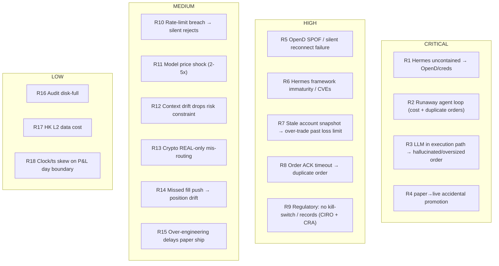

# Phase 2 — Devil's-Advocate Stress-Test & Risk Register

**Agent:** AGENT 4 (devils-advocate)
**Date:** 2026-06-07
**Inputs:** Phase 1 reports from business-product, financial-cost, tech-architect
**Operator context:** Solo retail operator based in **British Columbia, Canada**. Assets: US stocks/ETFs, HK stocks, options, crypto. Mandate: safety-first, paper-default, staged paper→live. Claude = signals only; deterministic risk in code.

---

## 0. Verdict Up Front

From a **pure risk standpoint, the PYTHON PATH wins decisively** — and not because Hermes is bad software, but because the two paths do not carry equal risk for a real-money, single-operator system:

- The Python path's safety guarantees are **structural and free** (one trust domain, reviewed static code, deterministic execution).
- The Hermes path can reach the *same* guarantees only by correctly building **and indefinitely maintaining** a 9-control out-of-process containment cage (tech-architect's C1–C9). For a solo operator, the probability that all nine are correct *and stay correct* is low, and a single silent regression (e.g., a network-namespace change) hands a self-modifying, shell-capable agent an **uncontained path to OpenD and brokerage credentials**. That is an unbounded-loss failure mode.
- Hermes is also a **4-month-old framework (Feb 2026)** with documented critical architectural vulnerabilities, plaintext credential storage by default, prompt-injectable persistent memory, and a malicious-skill marketplace problem. Granting it shell access *plus* brokerage credentials is, on current evidence, **not defensible for live money.**

**Recommended posture:** Python path to first paper-profitability. Use Hermes (if at all) **only outside the order path** — research digests, portfolio commentary, news routing — never holding broker credentials or the OpenD socket. Revisit Hermes-in-the-loop only after (a) the framework matures and (b) the out-of-process gate is built, tested, and audited.

This verdict is consistent with all three Phase 1 authors' own bottom lines; my job here was to attack those conclusions and they survived the attack. Where I push *harder* than Phase 1: on Hermes's security track record, on worst-case cost tails, on regulatory/tax obligations specific to a BC operator, and on the realism of containment for a solo operator.

---

## 1. Stress-Test of Phase 1 Authors

I sent each author a pointed challenge via SendMessage. Summaries below; full register in §4 incorporates their answers.

### 1.1 → business-product (comparability, maturity, execution-loop endorsement)

**My challenge:** (1) Hermes (a general autonomous *runtime*) vs the Python *app* is "a kitchen vs a knife" — not apples-to-apples. (2) "186k stars / weekly releases" are adoption signals, not *maturity* signals; a 4-month-old framework with weekly P0 churn is the opposite of mature for real money — which claims do you downgrade? (3) Is there ANY version of Hermes you'd endorse *in the execution loop*, or is it "non-execution only"?

**Response received (conceded on 1 & 2, held hard on 3):**
- **(1) Comparability:** Conceded the raw comparison is category-impure — the fair framing is "trading-app-built-on-the-Hermes-runtime vs purpose-built-Python-app," not "Hermes vs Python app." Crucially, the reframe *strengthens* the anti-Hermes case: a trading app built *on* Hermes inherits the runtime's properties unconditionally — its execution path runs *inside* the LLM inference loop, and you cannot carve a deterministic execution sublayer inside a non-deterministic runtime "without essentially rebuilding what the Python PATH already is, from scratch." ("If you need a surgical scalpel and someone offers you a professional kitchen, decline and buy the scalpel.")
- **(2) Maturity:** Walked it back fully. Downgrades: "186k stars" = a **hype signal, not a maturity signal** (popular ≠ stable); "production-ready" → **UNVERIFIED for any financial use**; cron reliability under financial load → UNVERIFIED; third-party trading skills (e.g., Hyperliquid) → untested/unaudited; weekly P0/P1 churn (8 P0 in v0.13; 12 P0 + 50 P1 in v0.14) → "a real-money system should not be upgraded weekly to stay secure." Net: **every Hermes capability is UNVERIFIED for financial use** until independently stress-tested with documented audit results.
- **(3) Execution-loop endorsement:** Unconditional **NO**. Verbatim for the register: *"Hermes Agent (any version as of 2026-06-07) is disqualified from the AutoTrader order execution path on structural grounds: non-deterministic runtime, context-compression risk, self-modifying skills, no financial authorization layer, and Docker approval bypass. Permissible use: non-execution, non-credential-adjacent, read-only commentary and research tasks only."* Rationale: context compression silently drops constraints (a function of LLM context windows, not a patchable bug); self-modification is the *mechanism, not a bug*; and the absence of a financial-authorization primitive is architectural, not a missing feature.

**My independent assessment (holds regardless):**
- The comparison *is* lopsided, and that asymmetry is itself the finding: choosing a general autonomous runtime for a narrow, safety-critical task imports a large attack/behavior surface you neither need nor can fully constrain. The Python app is scoped to exactly the task.
- Adoption ≠ maturity. Every Hermes *capability claim* (skill auto-gen, memory, cron, chat control) should be treated as **UNVERIFIED for financial use** until proven behind the containment gate. The "40% token reduction" and "production-ready" claims are explicitly self-reported.
- Honest position for the register: **Hermes has no defensible role in the v1 execution loop.** Acceptable Hermes uses are non-execution and credential-free.

### 1.2 → financial-cost (worst-case pricing, runaway loops, non-determinism labor, downtime $)

**My challenge:** Model 2× and 5× model-price increases with cadence creeping to 96/day; re-quantify runaway-loop damage (the "$50–500" figure looks low) and the hard cap that actually stops it; re-estimate Hermes labor TCO with 2–3 non-reproducible incidents/yr at $500–2000 each; and put a $ on OpenD downtime (missed exits) and the first live guardrail-gap incident.

**Response received (all four probes re-quantified; new "Tail-Cost & Worst-Case Appendix" added to the financial doc):**
- **(1) Worst-case inference.** Corrected for cadence creep: 96/day @ **5×** price = **$2,996/yr Python / $3,726/yr Hermes** (a 20× / 17× jump over baseline). The 2× scenario (~25–35% over 3 yrs) is the planning case; 5× is a ~5–10% tail. Fallback: Haiku 4.5 or Hermes-4 70B on DeepInfra for adequate-quality cheaper signals.
- **(2) Runaway loop, re-quantified against Anthropic tier limits.** Realistic Tier-2 overnight (8 hr, latency-limited) = **$334–$587**; theoretical saturated max = **~$1,296**. Original "$50–500" was low → **revised $100–$1,300/incident.** Critical operational finding: **the only configurable dollar stop is the Anthropic console MONTHLY cap — there is no daily cap, and rate limits throttle throughput but do NOT stop spend.** An 8-hr loop can burn an entire month's budget and halt legitimate trading for the rest of the cycle. Recommended hard-cap setup: dedicated non-default workspace + workspace ITPM sub-limit as a ~$50/day throttle + monthly cap at 3–5× expected + client-side circuit breaker on `anthropic-ratelimit-remaining-tokens` headers.
- **(3) Non-determinism labor.** A non-reproducible financial-system incident = **10–28 hrs ($750–$2,100)**. Revised annual maintenance: **Hermes ~$3,900/yr** (was $1,800 — underestimated 2.2×) vs **Python ~$825/yr**. Revised **Year-2+ all-in: Hermes ~$4,430 vs Python ~$1,282 → 3.5× gap** (wider than Phase 1's 2.5×).
- **(4) OpenD downtime + first live incident.** Downtime is $0 in paper; live = **$150–$1,800/yr** (options-expiry tail $200–$2,000/event); Python systemd watchdog MTTR 2–5 min vs Hermes 5–60 min. **First live incident expected cost ≈ $1,257** (probability-weighted). **If the known MASTER-account gap in `place_crypto_order.py`/`modify_order.py` ships to live unpatched, severe-scenario probability rises and expected cost jumps to $2,500–$4,200 — fix before any live deploy (affects BOTH paths; Hermes adds an autonomous-skill bypass vector).** Worst-case Year-2 all-in: **Python ~$6,273 vs Hermes ~$11,271.**

**My independent worst-case math (consistent with the revised numbers above):**
- **Inference worst case.** Phase 1 mid-case is Sonnet @ 24/day = ~$237/yr. At **96 decisions/day** Phase 1 already shows ~$946/yr (Sonnet). Apply a **3×** price shock → ~**$2,840/yr**; **5×** → ~**$4,730/yr**. The Hermes path carries a *second* model layer (orchestration), so multiply its exposure by ~1.3–1.7× on top. Worst-case Hermes inference (96/day, 5× prices, orchestration overhead) ≈ **$6–8k/yr** vs Python ≈ **$4.7k/yr**. Neither is catastrophic *if capped* — the danger is uncapped loops, not steady-state.
- **Runaway loop.** $50–500 understates an *overnight unsupervised* loop. A Hermes agent stuck in a retry/reasoning loop calling Sonnet (~$0.027/call) at even 1 call/sec = ~$97/hr → **~$780 over an 8-hr overnight window**; with tool-call fan-out and larger contexts, **low-thousands per incident** is realistic. The *only* hard stop is a **provider-side spend cap / budget key**, not in-agent logic (the agent can rewrite its own logic). This is a CRITICAL, Hermes-specific cost risk.
- **Non-determinism labor.** 2 hr/mo is optimistic for money-managing software. A non-reproducible incident (can't replay exact state) is realistically **0.5–3 days** of investigation. At 2–3/yr × $500–2000 → **$1.5–6k/yr** added labor — which erodes or erases Hermes's Year-1 dev-time savings.
- **OpenD downtime → direct $.** An outage during a move you intended to exit = **realized loss limited only by your stop discipline**, not a fixed number. Mitigation is fail-to-flat behavior, not a price.
- **First live guardrail-gap incident.** Bounded by `max_order_notional` × (worst slippage) **only if** the deterministic clamp is actually in the path. If a Hermes regression bypasses the clamp, it's bounded only by buying power. This is the single most important reason to keep the clamp out-of-process and the agent credential-free.

### 1.3 → tech-architect (over-engineering, OpenD SPOF, containment realism)

**My challenge:** (1) Is the broker-agnostic Protocol/adapter ring premature before any strategy is profitable — give the explicit v1 cut-line for a 2-week paper ship. (2) Yes/no: is a Moomoo-only system acceptable for LIVE money without a fallback broker? (3) Honest probability that a *solo BC operator* implements all of C1–C9 correctly and keeps them correct — and the residual if even one (e.g., network namespace) silently regresses.

**Response received (three register-ready answers; one critical new technical finding):**
- **(1) v1 cut-line.** "Safety lives in the risk core, NOT the abstraction — cut the abstraction, keep the core." **KEEP:** `risk_core.evaluate()` (daily-loss/drawdown/caps/kill-switch/size/env-route), JSONL audit written-first (E18), `is_opend_ready()` (free), `client_order_id` idempotency + "UNKNOWN is never success" (E2), `refresh_cache=True` for US paper (E1). **CUT for v1:** the abstract `Broker` Protocol + `BrokerError` taxonomy (ship `MoomooBroker` as a plain concrete class with the same method names — promoting to a Protocol later is a ~30-min mechanical refactor); normalized dataclasses except `AccountSnapshot` + `Position` (what the risk core reads); `SimBroker` (test the pure risk core with fixtures); SQLite (JSONL is source of truth in v1); the full watchdog thread (v1 = soft-halt + re-run `is_ready` on NOT_READY/TRANSIENT); and **all Hermes/C1–C9.** Net v1 ≈ `main.py` + `risk_core.py` + concrete `MoomooBroker` + JSONL + existing `opend_ready.py` — "as safe as the full design for paper."
- **(2) OpenD SPOF — a 2nd broker adapter is NOT the right hard gate (partly theater).** A second adapter lets you place *new* orders elsewhere but **cannot flatten the position you already hold AT Moomoo during an OpenD outage** — so it doesn't address the real exposure. The actual **HARD LIVE prerequisites** (cheaper, more effective): (a) **fail-to-flat / reduce-only** default on OpenD loss beyond a grace window — never open blind; (b) an **out-of-band manual kill path** via the Moomoo app/GUI that does *not* use the OpenD API socket; (c) **hard stops RESTING at the broker** so an outage can't run a position unbounded; (d) dedicated always-on host + supervisor. Mark "2nd adapter" as a resilience *enhancement*, not a gate.
- **(3) C1–C9 realism — ~15–25%, and "stays correct" is worse than "gets built."** **CRITICAL NEW FINDING: OpenD's local socket at `127.0.0.1:11111` is UNAUTHENTICATED — it trusts anything that can reach the port.** Therefore **C3 (no OpenD route in the agent sandbox) is single-point and load-bearing:** if C3 silently regresses, the agent simply calls `OpenSecTradeContext()` itself and the **entire risk core is bypassed, paper AND live** — and C1/C2 immutability don't help because the agent doesn't need to *edit* the core, it opens its own context. The only blast-radius cap left is C5's manual GUI unlock (the two-key rule), which is "exactly why that rule matters most when containment is weakest." Recommendation: **never run a shell-capable Hermes agent against a live-capable OpenD at all** — keep Hermes paper-only (C3 regression then bounded to virtual money) or **air-gap OpenD onto a separate host** (a box boundary is far harder to silently regress than an in-host namespace).

> **§1.3 one-liner (tech-architect):** *C3 is single-point, load-bearing, and silently regressible; OpenD's unauthenticated local socket means C3 failure = full guardrail bypass. Solo-operator mitigation: never give a shell-capable agent live-OpenD reachability — keep Hermes paper-only or air-gap OpenD onto a separate host.*

**My independent assessment (holds regardless):**
- **Over-engineering:** Partially fair to build the *port* now (it confines Moomoo-isms and enables `SimBroker` testing with no live OpenD), but building *multiple adapters* now is premature. **v1 cut-line:** Python `main.py` driver + single `MoomooBroker` + **in-process** deterministic risk core + SQLite/JSONL audit + reuse `is_opend_ready()`. **Cut for v1:** Hermes, the IPC gate, the second broker adapter, the vector-store memory tier, crypto (REAL-only — adds live-routing risk), and HK L2 data. Ships to paper in ~2 weeks.
- **OpenD SPOF:** It is an irreducible local-daemon single point of failure with **no cloud fallback** and a **manual login/2FA** that cannot be fully automated. For LIVE money, the honest answer is that a second broker adapter is the *only true redundancy* — but it is not a strict prerequisite **if** the system fails safe (soft-halt on heartbeat miss, cancel-on-disconnect, no trading blind). A latency-sensitive strategy on a single OpenD is not safe; a slow, fail-to-flat strategy can be.
- **Containment realism:** For a solo operator, the probability that **all** of C1–C9 are implemented correctly *and remain* correct across OS updates, dependency bumps, and config drift is **low** — I'd put it well under 50% sustained. And containment is **all-or-nothing**: if the network namespace regresses, the agent can `pip install moomoo-api` and open `127.0.0.1:11111` itself, bypassing every deterministic guardrail. That fragility is why Hermes-in-the-loop is HIGH/CRITICAL risk for this operator profile.

### 1.4 Note on responses

All three teammates replied and their answers are incorporated above. The stress-test materially changed the analysis in three ways: business-product **walked back the maturity claims** and made the Hermes-out-of-execution position **unconditional**; financial-cost **re-quantified the tail costs upward** (runaway-loop $100–$1,300/incident with *no daily spend cap*; Hermes Year-2 all-in 3.5× Python) and surfaced the **MASTER-account gap** as a live-incident amplifier; and tech-architect produced the single most important technical finding in this phase — **OpenD's local socket is unauthenticated**, which collapses Hermes containment to one load-bearing control (C3) and reframes the OpenD-SPOF mitigation away from "second broker adapter" toward fail-to-flat + resting hard-stops + out-of-band kill.

---

## 2. Independent Research (cited; retrieved 2026-06-07)

### 2.1 Regulatory & Compliance

**Canada / CIRO (operator is in BC).**
- Algorithmic/automated trading by retail is **legal in Canada**, overseen by CIRO and provincial regulators (in BC, the BC Securities Commission under the CSA umbrella). CIRO's *Guidance Respecting Electronic Trading* expects automated systems to have **built-in safeguards — kill switches and price/volume limits** — to prevent excessive losses and market disruption. This directly *validates* the Python path's deterministic kill-switch/clamp design and is an argument **against** non-deterministic execution. [CIRO electronic trading guidance]
- **Tax (material for a solo operator):** the CRA generally treats **frequent algorithmic trading as business income** (not capital gains), so every trade must be logged and records kept. The system's append-only JSONL + SQLite audit trail is not just good engineering — it's effectively a **tax-compliance requirement**. [search synthesis, CRA treatment]
- **Crypto:** CIRO's 2026 Digital Asset Custody Framework and CSA rules tighten the rules for *crypto trading platforms/custodians* (registration, 80% with acceptable third-party custodian, tiered custody). This is platform-side, but the operator should confirm **Moomoo's crypto offering is available/registered to a BC resident** before trading crypto live; crypto on Moomoo is also **REAL-only (no paper)**, compounding the risk. [CIRO crypto custody framework, 2026-02]

**US PDT rule — MAJOR 2026 change.**
- The **Pattern Day Trader rule was eliminated effective June 4, 2026** (3 days before this report). The $25,000 minimum equity floor and the four-day-trades-in-five threshold are **gone**, replaced by a **real-time intraday margin** framework; brokers may phase in through Oct 20, 2027. **Implication:** a key historical constraint on a small US-margin algo account no longer applies — but this *removes a guardrail*, so the system's **own** position/loss/exposure caps become the binding safety limit. Don't let "PDT is gone" become "trade unrestricted." [NerdWallet, E*TRADE, TradeStation, 2026]

**HK considerations.** HK L1 data is free to global users; **HK L2 is paid**. HK trading via Moomoo is supported natively in the SDK but adds market-hours/holiday-calendar and settlement nuances; treat HK as a phase-2 asset class after US paper validation.

**Moomoo OpenD automated-trading ToS.**
- Moomoo **explicitly supports automated/algorithmic trading via the OpenAPI/OpenD** ("program-based automatic order placement … algorithmic trading are possible"; "fully supports automated trading of US stocks"). In April 2026 Moomoo launched **"Moomoo API Skills" (agentic investing)** and emphasizes that **credentials and account data stay in the user's local environment, never passing through third-party AI servers**, and that **the user remains the ultimate authority over every transaction**. **Implication:** automated trading is permitted, but the "credentials stay local / user is final authority" posture is *in direct tension* with handing those local credentials to an autonomous Hermes agent with shell access. [moomoo.com OpenAPI, Moomoo API Skills newsroom, 2026-04]

### 2.2 LLM-in-the-Trade-Loop Risk Literature

- **Documented risk classes:** hallucinated/fluent-but-false outputs → flawed trades; **non-determinism** (different answers to identical inputs) → consistency failures; **latency** from multi-step reasoning → unfit for time-sensitive execution; and **error propagation** — hallucinated facts/tool outputs cascade through agent loops, "propagating high-risk failures when intervening on calls to external tools or APIs." [arXiv 2509.11420 Trading-R1; arXiv 2605.19337 Agentic Trading; Springer EMSE 2026 LLM-in-the-loop safety study]
- **Standard mitigations (which the Python path already embodies):** a **deterministic state store** holding positions/orders/balances/risk-limits that is **read-only to the LLM and updated solely by the environment**; **human-in-the-loop** review for promotion/high-impact actions; **pre-calibrated confidence thresholds** that flag/reject/escalate anomalous calls; deterministic clamps on size/price. The literature's consensus design is *exactly* the "Claude = signals only, deterministic risk in code" architecture — and is *exactly what Hermes-in-the-loop violates by putting an LLM in the execution path.* [Alkymi, Appsmith de-hallucination; AlphaGPT human-in-the-loop]

### 2.3 Hermes Agent Maturity, Security & Track Record

This is where independent research is most damning for the Hermes-in-the-loop path:

- **Age & churn:** released **Feb 2026** (~4 months old at report date); rapid weekly releases with heavy security churn.
- **Independent audit (April 11, 2026):** **4 Critical + 9 High** severity findings in the **default configuration** across 812 Python files. Default behaviors include **unrestricted shell execution** ("arbitrary commands to `bash -c` via `subprocess.Popen` using only regex-based detection as a guard"), **no command allowlist, no approval requirements by default**, and **plaintext API-key storage** (`~/.openclaw/credentials/`). [aurpay.net; CSA Labs research note]
- **Disclosed CVEs:** CVE-2026-7396 (path traversal, WeChat adapter), CVE-2026-7397 (symlink following, file tools), CVE-2026-6829 (WebUI path traversal). [CSA Labs, 2026-05]
- **Persistent-memory poisoning (Hermes-specific, rated most severe):** an attacker plants hidden instructions in a document; when the agent summarizes it, the poisoned entry **persists silently in the SQLite memory store** and is retrieved + executed in future sessions. **Standard prompt-injection defenses watch the user turn; memory retrieval bypasses that surface entirely.** [Repello AI threat model]
- **Malicious-skill marketplace:** as of early 2026, **~36% of marketplace skills contained detectable prompt injection**; **1,467 malicious skills** identified by February. Self-written/auto-generated skills create persistent prompt-injection vectors across sessions. [Repello AI; aurpay.net]
- **Container deployments unconditionally skip approval checks** — i.e., the most likely "prod" deployment mode is *less* safe, not more. [CSA Labs; aurpay.net]
- **Vendor guidance itself** discourages running Hermes on workstations with sensitive resources and recommends VM/container isolation, memory encryption, deny-by-default skill manifests, and full tool-call logging to SIEM. The threat model explicitly concludes **deterministic guardrails are insufficient; runtime prompt-layer policy enforcement is mandatory** for high-risk use. [Repello AI]

**Bottom line:** granting this framework, in its current state, **shell access + brokerage credentials** is contraindicated by its own vendor's guidance and by every independent reviewer surveyed.

### 2.4 Moomoo OpenD Reliability, Limits & Failure Modes

- **OpenD is a local daemon** (`127.0.0.1:11111`); the SDK talks only to it; **no cloud fallback.**
- **The OpenD local socket is effectively UNAUTHENTICATED** — it trusts any local process that can reach the port (confirmed by tech-architect; consistent with the documented "set listening address to `0.0.0.0`" guidance and connection-cap model, which gate *reachability*, not caller identity). This is the load-bearing fact behind R1: any process on the host that can open `127.0.0.1:11111` can place orders, bypassing every application-level guardrail. Operational implication: treat host-local network reachability to OpenD as equivalent to holding trade authority.
- **Token-expiry / reconnect failure:** "when the token expires, if there is network fluctuation or moomoo background release, it may cause the situation that it cannot be automatically connected after disconnecting" — i.e., **silent failure to auto-reconnect**; Moomoo recommends a manual password login for long-running hang-ups. This is a real, documented SPOF behavior. [Moomoo OpenD QA]
- **Rate limits (must be respected by the router):**
  - `place_order`: **max 15 requests / 30s per acc_id**, min 0.02s between requests; **shares the limit with combo orders**.
  - Market snapshot: **60 requests / 30s**.
  - Refreshing position/order/account queries (US paper `STOCK_AND_OPTION`): effectively **10 refreshing queries / 30s per account** (the dashboard's `refresh_seconds ≥ 20` rule derives from this).
  - OpenD connection cap: **128 connections.** [Moomoo authority/quota & trade QA docs]
- **Platform-specific bug:** on Linux/Mac, threads created inside `py-moomoo-api` in a parent process **disappear in a forked child**, causing internal errors — relevant if the orchestrator forks workers. [Moomoo OpenD QA]
- **US paper accounts may not receive fill push data** (per the repo's SKILL.md) → reconciliation must **poll** as source of truth, not rely on pushes.

---

## 3. Risk Map (visual)

---

## 4. RISK REGISTER (primary deliverable)

Severity = function of Likelihood × Impact, adjusted for a **solo retail operator, real money**. Path: **H**=Hermes-specific, **P**=Python-specific, **B**=Both.

| ID | Risk | Category | Path | Likelihood | Impact | Severity | Specific Mitigation | Residual |
|----|------|----------|------|-----------|--------|----------|---------------------|----------|
| **R1** | Self-modifying, shell-capable Hermes agent reaches OpenD directly by opening the **unauthenticated** `127.0.0.1:11111` socket itself (or pip-installing the SDK), bypassing the entire risk core — paper AND live. **C3 (no OpenD route in sandbox) is the single load-bearing control; if it silently regresses there is no defense-in-depth behind it** (C1/C2 immutability don't help — the agent opens its own context, it needn't edit the core) | LLM-in-loop / Security / Financial-loss | H | Med (→High if C3 regresses; solo-operator full-C1–C9 success only ~15–25% and degrades over time) | Catastrophic (unbounded loss, bounded only by buying power) | **CRITICAL** | **Never run a shell-capable Hermes agent with reachability to a live-capable OpenD.** Preferred: keep Hermes **paper-only** (C3 regression then bounded to virtual money) or **air-gap OpenD onto a separate host** (box boundary far harder to silently regress than an in-host namespace). The two-key rule (C5: manual GUI unlock for LIVE) is the only blast-radius cap when containment is weak. For v1, exclude Hermes from execution entirely. | ~0 if Hermes excluded from execution (recommended); Med-High if in-loop even with C1–C9 |
| **R2** | Runaway autonomous loop: retry/reasoning loop overnight → token blow-up **and** duplicate order submission | Cost / Financial-loss | H | Med | High ($100–$1,300/incident, Tier-2; duplicate live orders) | **CRITICAL** | **Note: Anthropic console has only a MONTHLY cap, no daily cap; rate limits throttle throughput but do NOT stop spend.** Use a dedicated non-default workspace + workspace ITPM sub-limit (~$50/day throttle) + monthly cap at 3–5× expected + client-side circuit breaker on `anthropic-ratelimit-remaining-tokens`. Idempotent `client_order_id` echoed in order remark; external watchdog in a separate trust domain; per-symbol serialization. | Low if Python path (no autonomous loop); Med if Hermes |
| **R3** | LLM hallucinates symbol/size or over-confident signal → oversized/wrong order | LLM-in-loop / Financial-loss | B (worse H) | Med | High | **CRITICAL** | Claude = **signals only** (data value, not command); deterministic confidence threshold; **`max_order_notional` clamp + position/exposure caps in code**; validate `Symbol` against a tradable allow-list before sizing; read-only state store the LLM cannot mutate. | Low (Python: clamp always in path); Med-High (Hermes: clamp bypassable) |
| **R4** | Accidental paper→live promotion (env flag flipped, or Hermes self-promotes) → real-money orders during validation | Paper→live / Financial-loss | B | Low-Med | Catastrophic | **CRITICAL** | **Two-key rule:** `TRADING_ENV=LIVE` **and** manual OpenD GUI unlock, both checked in adapter; never call `unlock_trade` via SDK; LIVE key held only by out-of-process core; **automatic demotion to paper on any halt**; promotion is a human gate only. | Low (Python); Med (Hermes — env self-mutation risk) |
| **R5** | OpenD single point of failure: crash, laptop sleep, token-expiry **silent** reconnect failure → loop blind, orphan working orders, missed exits. **A 2nd broker adapter is NOT the fix** — it can place new orders elsewhere but cannot flatten a position already held at Moomoo during the outage | OpenD-SPOF / Operational | B | High (documented) | High | **HIGH** | **HARD LIVE-blockers (not the 2nd adapter):** (a) **fail-to-flat / reduce-only** default on OpenD loss beyond grace window — never open blind; (b) **out-of-band manual kill** via Moomoo app/GUI (not the OpenD socket); (c) **hard stops RESTING at the broker** so an outage can't run a position unbounded; (d) dedicated always-on host + supervisor. Reuse `is_opend_ready()` gate; watchdog heartbeat; soft-halt on miss; full reconcile before resuming. 2nd broker adapter = resilience *enhancement*, not a gate. | Med — manual 2FA re-login can't be fully automated; accept slow/fail-to-flat behavior |
| **R6** | Hermes framework immaturity: 4 Critical+9 High audit findings, 3 CVEs, plaintext creds, malicious-skill marketplace, container approval-bypass | Security / Operational | H | High (current state) | High | **HIGH** | Exclude Hermes from any credentialed/execution role in v1; if used for research/commentary, run **credential-free, VM-isolated, deny-by-default skills, memory encrypted, all tool calls logged**; pin versions; re-audit each upgrade. | Med (research-only); High (if in-loop) |
| **R7** | Stale account snapshot (US paper `STOCK_AND_OPTION` w/o `refresh_cache=True`) → risk checks on wrong P&L → over-trade past loss limit | Data-integrity / Financial-loss | B | Med | High | **HIGH** | Adapter **forces `refresh_cache=True`** for those acc_ids; risk core **rejects on `snapshot.stale`**; never compute halts on stale basis. | Low |
| **R8** | Order ACK timeout / socket drop mid-call mapped as success → duplicate order on retry | Execution / Financial-loss | B | Med | High | **HIGH** | Map TIMEOUT → `OrderState.UNKNOWN` (**never** success); before any retry, query open orders by `client_order_id`; idempotency key in remark. | Low |
| **R9** | Regulatory/compliance: missing kill-switch or trade records (CIRO expects safeguards; CRA treats algo trading as business income requiring full records) | Regulatory | B | Low-Med | High (penalties, tax reassessment) | **HIGH** | Deterministic kill-switch + price/size limits (CIRO-aligned); **append-only JSONL + SQLite audit = tax record**; retain records; confirm Moomoo crypto availability to a BC resident before live crypto. | Low (Python already designed for this) |
| **R10** | Rate-limit breach (`place_order` 15/30s, snapshot 60/30s, refresh 10/30s) → silent order rejects / starved reconciliation | API-limits / Operational | B | Med | Med | **MEDIUM** | Router token-bucket (15/30s) with queue+backpressure; cap reconcile cadence; `refresh_seconds ≥ 20`; surface `RATE_LIMIT` as retryable. | Low |
| **R11** | Model/API price shock 2–5× and/or cadence creep to 96/day → inference $237→ up to ~$4.7k (Python) / ~$6–8k (Hermes, 2 model layers) per yr | Cost | B (worse H) | Med | Med | **MEDIUM** | Provider spend caps; cadence ceiling in config; prompt caching on static system prompt; model-substitution plan (Haiku/cheaper orchestration); budget buffer. | Low |
| **R12** | Hermes context compression silently drops a risk constraint defined early in session | LLM-in-loop / Non-determinism | H | Med | High (if constraint is a risk limit) | **MEDIUM** (→ HIGH if Hermes holds any limit) | **Never** store risk limits in LLM context — they live in frozen-dataclass config read by deterministic core; LLM gets read-only state only. | Low if limits stay in code (mandatory) |
| **R13** | Crypto is **REAL-only** on Moomoo (no SIMULATE) → "paper" crypto silently routed live, or auto-promoted | Paper→live / Financial-loss | B | Low | High | **MEDIUM** | Adapter rejects crypto+PAPER as `UNSUPPORTED`; **never** auto-promote to LIVE; defer crypto to a post-paper-validation phase. | Low |
| **R14** | US paper accounts may not receive fill push → position/P&L drift; halts fire late | Data-integrity | B | Med | Med | **MEDIUM** | **Poll `reconcile_fills(since)` as source of truth**, not pushes; dedupe by `fill_id` (unique index). | Low |
| **R15** | Over-engineering (full broker-agnostic ring, IPC gate, 2nd adapter) before any profitable strategy → delayed paper ship, wasted effort | Product / Schedule | P | Med | Low-Med | **MEDIUM** | v1 cut-line: Python driver + single `MoomooBroker` + in-process risk core + audit + `is_opend_ready()`. Build the *port* (cheap, enables `SimBroker` tests); defer extra adapters/IPC/Hermes/crypto/HK-L2. | Low |
| **R16** | Audit write failure (disk full) → silent loss of forensic/tax trail | Operational / Regulatory | B | Low | Med | **LOW** | Treat audit-write failure as **hard error → halt new orders** (no order without its audit line written first). | Low |
| **R17** | HK Level-2 data cost / HK calendar complexity surprises | Cost / Operational | B | Low | Low | **LOW** | Defer HK to phase 2; use HK L1 (free) only if needed; model L2 cost before enabling. | Low |
| **R18** | Clock/ts skew between local and broker → wrong "today" P&L window → daily-loss halt mis-times | Data-integrity | B | Low | Med | **LOW** | Use **broker-provided fill timestamps**; derive day boundary from market calendar, not local clock. | Low |
| **R19** | **Known MASTER-account authorization gap** in `place_crypto_order.py` and `modify_order.py` (missing the role check that `place_order.py` has) → trades execute on a master account affecting the whole account group | Security / Financial-loss | B (Hermes adds autonomous-bypass vector) | Med (if used as-is) | High (group-wide scope; raises live-incident EV to $2.5–4.2k) | **HIGH** | **Patch before any live deploy:** add the `place_order.py` MASTER role-rejection check to both scripts; covered in repo `.remember` findings. Affects both paths equally; Hermes can additionally bypass via a self-written skill. | Low once patched |

### Severity tally
- **CRITICAL:** R1, R2, R3, R4 (all four either Hermes-specific or made far worse by Hermes-in-loop; all four mitigated structurally by the Python path)
- **HIGH:** R5, R6, R7, R8, R9, R19
- **MEDIUM:** R10–R15
- **LOW:** R16–R18

---

## 5. Cross-Cutting Conclusions

1. **Every CRITICAL risk is either Hermes-specific (R1, R2) or materially worsened by putting an LLM in the execution path (R3, R4).** The Python path neutralizes all four *structurally* — the clamp/kill-switch is always in the path, there is no autonomous loop, and the LLM output is a data value, not a command. This is the decisive risk argument.

2. **OpenD SPOF (R5) is the top risk the Python path can't design away** — it's operational, not architectural. Mitigate with fail-to-flat behavior and a dedicated host; a second broker adapter is the only true redundancy and should be a **pre-live** (not pre-paper) goal.

3. **Regulation actually favors determinism.** CIRO expects kill-switches and limits; CRA requires complete trade records. The Python path's deterministic guardrails and append-only audit trail are compliance assets, not just engineering nicety. The **2026 PDT-rule elimination removes an external guardrail** — making the system's own caps the binding safety limit, so don't loosen them.

4. **Moomoo permits automated trading but its security model ("credentials stay local, user is final authority") is in direct tension with an autonomous shell-capable agent holding those credentials.** Honor Moomoo's posture: keep credentials out of any agent sandbox.

5. **Staging discipline:** paper (fail-to-flat, full audit, weeks of clean runs) → LIVE_SMALL (reduced caps, kill-switch tested live) → LIVE_FULL, with **automatic demotion on any halt** and **human-only promotion**. Crypto and HK are post-validation phases.

---

## 6. Top 5 Risks (for team-lead)

1. **R1 — Hermes uncontained path to OpenD (CRITICAL).** OpenD's local socket is **unauthenticated**, so a shell-capable agent that can reach `127.0.0.1:11111` *is* the trade authority — C3 is the single load-bearing control with no defense-in-depth behind it, and a solo operator keeping all of C1–C9 correct is ~15–25% and degrades over time. → Never give a shell-capable agent live-OpenD reachability; keep Hermes paper-only or air-gap OpenD; exclude Hermes from v1 execution.
2. **R2 — Runaway autonomous loop (CRITICAL):** $100–$1,300/incident; **Anthropic has no daily spend cap** (monthly only; rate limits don't stop spend), so an overnight loop can burn the month's budget. Only a dedicated-workspace sub-limit + client-side circuit breaker truly bounds it.
3. **R3 — LLM hallucinated/oversized order (CRITICAL):** mitigated structurally only when the deterministic clamp is always in-path (Python), bypassable in Hermes.
4. **R4 — Accidental paper→live promotion (CRITICAL):** the two-key rule (env flag + manual GUI unlock) is the *most important* control precisely because it's the only blast-radius cap when containment is weak; plus auto-demotion on any halt; LIVE key never held by the agent.
5. **R5 — OpenD single point of failure (HIGH):** documented silent reconnect failure + manual 2FA; the fix is **fail-to-flat + resting hard-stops at the broker + out-of-band kill**, NOT a second adapter (which can't flatten an existing Moomoo position during an outage).

*(Also HIGH: R19 — patch the known MASTER-account authorization gap in `place_crypto_order.py`/`modify_order.py` before any live deploy; it raises the first-live-incident expected cost to $2.5–4.2k and Hermes can bypass it via a self-written skill.)*

**Risk-standpoint verdict:** **PYTHON PATH.** It eliminates the four CRITICAL risks by construction at near-zero containment cost. Hermes can only *approach* the same safety after expensive, fragile, indefinitely-maintained isolation whose single load-bearing control (C3, against an *unauthenticated* OpenD socket) a solo operator is unlikely to keep correct — and a silent regression yields full guardrail bypass on real money. Financially the gap is also wider than Phase 1 showed (Hermes Year-2 all-in ~3.5× Python once non-determinism incident labor is counted). Use Hermes, if at all, **credential-free, paper-only, and outside the order path.**

---

## 7. Sources (retrieved 2026-06-07)

**Regulatory / compliance**
- CIRO — Guidance Respecting Electronic Trading: https://www.ciro.ca/newsroom/publications/guidance-respecting-electronic-trading
- CIRO — Supervision of Algorithmic Trading (Q&A): https://www.ciro.ca/newsroom/publications/specific-questions-related-supervision-algorithmic-trading
- CIRO — Digital Asset Custody Framework (2026-02): https://www.ciro.ca/newsroom/publications/ciro-issues-guidance-digital-asset-custody-crypto-asset-trading-platforms
- CoinDesk — Canada crypto custody rules (2026-02-03): https://www.coindesk.com/policy/2026/02/03/canada-s-investment-regulator-rolls-out-crypto-custody-rules-to-avoid-another-quadrigacx
- NerdWallet — PDT rule eliminated 2026: https://www.nerdwallet.com/investing/news/pattern-day-trading-rule-change
- E*TRADE — PDT rule change: https://us.etrade.com/knowledge/library/margin/pattern-day-trading-rule-change
- TradeStation — day-trade rule change (2026-05-06): https://www.tradestation.com/insights/2026/05/06/day-trade-rule-change/

**Moomoo / OpenD**
- Moomoo OpenAPI Introduction: https://openapi.moomoo.com/moomoo-api-doc/en/intro/intro.html
- Moomoo OpenD QA (reconnect/token/failure modes): https://openapi.moomoo.com/moomoo-api-doc/en/qa/opend.html
- Moomoo Trade QA (place_order 15/30s limit): https://openapi.moomoo.com/moomoo-api-doc/en/qa/trade.html
- Moomoo Authorities & Quota: https://openapi.moomoo.com/moomoo-api-doc/en/intro/authority.html
- Moomoo API Skills / agentic investing (2026-04): https://www.moomoo.com/us/newsroom/moomooapiskills
- StockTitan coverage of Moomoo API Skills: https://www.stocktitan.net/news/FUTU/moomoo-launches-agentic-investing-with-introduction-of-moomoo-api-fvi247vymywb.html

**LLM-in-the-loop risk**
- Trading-R1 (arXiv 2509.11420): https://arxiv.org/pdf/2509.11420
- Agentic Trading (arXiv 2605.19337): https://arxiv.org/html/2605.19337v1
- Securing LLM-in-the-loop software (Springer EMSE, 2026): https://link.springer.com/article/10.1007/s10664-026-10820-8
- De-hallucinating AI agents (Appsmith): https://www.appsmith.com/blog/de-hallucinate-ai-agents

**Hermes Agent security/maturity**
- CSA Labs — 9 CVEs / Hermes Agent research note (2026-05): https://labs.cloudsecurityalliance.org/research/csa-research-note-hermes-agent-cves-20260504-csa-styled/
- Repello AI — Hermes Agent threat model: https://repello.ai/blog/hermes-agent-security
- aurpay.net — Hermes Agent security risks (financial): https://aurpay.net/aurspace/hermes-agent-security-risks-crypto-2026/
- Nous Research — Hermes Agent security docs: https://hermes-agent.nousresearch.com/docs/user-guide/security/

*End of Phase 2 devil's-advocate findings.*
